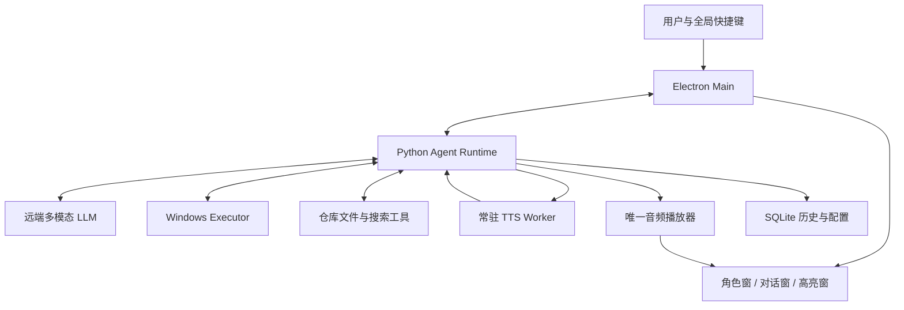

# Ayana 全能桌面助手：完整实施方案

版本：v0.1  
日期：2026-10-04  
项目：`ayana-agent`  
开发目录：`D:\ayana-agent`  
远端：[voicepeak/ayana-agent](https://github.com/voicepeak/ayana-agent)  
语音资源：[voicepeak/ayana_SoVITS](https://github.com/voicepeak/ayana_SoVITS)

本文将产品目标、调研事实、建议设计、开发顺序和验收标准整理为实施基线。当前仓库只有文档和 Git 配置，本文中的程序、服务与协议尚未实现。已检查本地语音源码、系统硬件信息和立绘索引；尚未执行推理基准或远端模型测试。所有性能预算和动画参数均为待验证目标。

## 1. 产品目标

Ayana 是用户主动呼出的桌面助手，使用用户提供的角色立绘和日语音色。她能理解当前窗口，结合文件与工具帮助用户学习和操作，并通过声音、表情和连续对话提供陪伴感。

### 1.1 已确认的要求

- 用户按可配置的全局快捷键呼出会话。
- Ayana 观察用户正在面对的窗口，支持多模态识图。
- 能围绕代码仓库等陌生内容进行讲解，逐步指导用户。
- 回复使用日语语音；对应内容可以显示中文翻译。
- 立绘表达与当前正在说的话一致，切换自然。
- 支持 computer use，本地执行鼠标、键盘和控件操作。
- 以迅速、有用、连续、可打断为交互目标。
- 人设通过 Markdown 配置和少量对话样例维护。

### 1.2 首个完整场景

用户打开陌生仓库或编辑器，按快捷键，说或输入“这个仓库怎么开始学”。Ayana 保存原目标窗口、获取截图、读取必要资料，先给一个简短且有用的日语解释。中文翻译和立绘跟随播放进度。用户可以追问、要求展示具体文件、选择执行一步，或随时打断。

体验示例：

> 屏幕：先看 README 和项目入口，建立整体结构。  
> 语音：まず、README と入口のファイルから一緒に見ていこう。  
> 立绘：平静的解释表情。  
> 下一步：展示一个真实读取的文件或定位一个窗口区域。

### 1.3 首版范围

| 能力 | 首版范围 | 后续扩展 |
| --- | --- | --- |
| 呼出 | 全局快捷键、托盘、显示与关闭会话 | 语音唤醒 |
| 输入 | 文字输入；预留按住说话接口 | 按住说话、全双工语音 |
| 观察 | 单个普通权限目标窗口的截图与基本信息 | 多窗口联动、按需持续观察 |
| 教学 | 屏幕问答、代码文件读取、搜索、逐步讲解 | 专业技能、长任务规划 |
| 语音 | 日语短句流水线、缓冲、打断 | 真流式、多参考语气 |
| 立绘 | 正常校服 PNG 表情和姿势切换 | 眼嘴图层、Live2D、口型 |
| 操作 | 高亮、用户选定的单步点击/输入/滚动 | 可暂停的多步任务 |
| 记忆 | 当前会话、历史摘要和用户显式偏好 | 项目知识与长期记忆 |

“全能”是扩展方向。首版先完成一条稳定的端到端交互，再通过工具适配器和技能增加任务类型。

## 2. 现有资源与已核实约束

### 2.1 语音

现有模型基于 GPT-SoVITS v2Pro。项目说明日语表现可靠，符合本项目只说日语的要求。公开 README 报告 CPU RTF 约 0.7–1.0；本次没有复测。[Ayana README](https://github.com/voicepeak/ayana_SoVITS/blob/main/README.md)

本机系统信息为 Intel Core Ultra 7 265K，20 核/20 线程，显示设备包含 Intel Graphics 和虚拟显示驱动，未发现 NVIDIA CUDA 显卡。规划以 CPU 推理为基线，不能套用 README 中 RTX 4090 的速度。

本地代码检查结果：

| 问题 | 影响 | 实施要求 |
| --- | --- | --- |
| `synth()` 等整次结果，`synth_long()` 等所有分块后拼接 | 分块合成尚不能提前播放第一句 | 增加逐句输出和播放调度 |
| 显式 SoVITS 加载调用没有迭代上游 generator | 指定权重的切换未可靠执行，默认加载可能掩盖问题 | 修复加载并记录真实权重路径 |
| 旧接口逐次读取参考音频和提取条件 | 每句重复开销 | 使用长驻实例和参考条件缓存 |
| 上游约 0.3 秒尾静音，包装层另加约 0.06 秒 | 连续拼接可能出现较长句间空白 | 区分 padding 与自然停顿，统一调度 |
| 分块异常捕获后继续，默认可能无日志 | 某句无声消失 | 返回明确失败事件，不允许静默漏句 |
| 共享全局模型、缓存和配置，无请求隔离 | 不可假设多线程合成安全 | 首版单 worker 串行推理 |
| 基准在导入模型后才计部分加载耗时 | 无法代表完整冷启动 | 新基准从进程启动和实际播放分别测量 |

对应本地证据：[加载调用](D:/ayana-voice/publish/ayana_SoVITS/src/ayana_tts.py:87)、[synth](D:/ayana-voice/publish/ayana_SoVITS/src/ayana_tts.py:116)、[synth_long](D:/ayana-voice/publish/ayana_SoVITS/src/ayana_tts.py:154)、[异常处理](D:/ayana-voice/publish/ayana_SoVITS/src/ayana_tts.py:167)、[参考处理](D:/ayana-voice/GPT-SoVITS/GPT_SoVITS/inference_webui.py:850)、[上游 generator](D:/ayana-voice/GPT-SoVITS/GPT_SoVITS/inference_webui.py:261)、[benchmark](D:/ayana-voice/publish/ayana_SoVITS/src/benchmark.py:25)。

本地上游 HEAD 为 `48b1a0169a28582a8984402f82cf438d3bfa6aca`。静态检查不能证明当前默认加载的音色一定错误；应通过显式加载与试听确认。

### 2.2 立绘

正常校服素材共有 52 张完整透明 RGBA PNG：

| 姿势 | 数量 | 尺寸 |
| --- | --- | --- |
| 双手交叠 | 26 张 | 472 × 1656 |
| 双手摊开 | 26 张 | 592 × 1656 |

现有素材适合表情、姿势、淡入和轻微呼吸运动。眼睛、嘴巴和情绪合在完整图片中，不能直接提供可靠眨眼与真实口型。表情名称沿用用户命名，语义映射需要人工看图确认，不能据此确定原作性格。[素材索引](C:/Users/纪/Desktop/z1_完整立绘_普通表情_脚本/素材索引.md:5)

### 2.3 当前待确认事项

原作人物设定、用户称呼、目标模型供应商、API 凭证、最终快捷键、是否将麦克风输入纳入首次演示，以及本机实际延迟尚未确定。接口和配置支持替换；这些信息不阻碍先完成本地固定文本语音原型。

## 3. 设计原则

1. **日语进入语音快路径。** 中文翻译、表情分类和日志不能阻塞已提交的语句合成。
2. **音频播放是同步基准。** 立绘和字幕跟随实际播放，不跟随模型输出或合成完成时间。
3. **计算与表现分离。** UI、模型、TTS、播放和电脑操作分别运行，重计算不拖住界面。
4. **先输出有用的小段。** 每次讲解先推进一个关键点，控制语音积压。
5. **用户随时接管。** 打断停止后续语音和动作，旧结果不能恢复执行。
6. **状态来自事实。** 正在思考、正在说话、操作成功由实际事件决定，人设不改变这些事实。
7. **闭合并校验后提交。** 半截 JSON、表达标签、内部推理和工具日志不能送进 TTS。
8. **以测量决定扩展。** Jev、真流式、并行推理和多语气都需要证明净收益。

## 4. 技术基线与模块划分

### 4.1 推荐技术栈

| 层 | 推荐基线 | 理由与验证点 |
| --- | --- | --- |
| 桌面壳 | Electron + TypeScript | 已有全局快捷键、透明置顶窗、点击穿透接口；验证普通用户发布包行为 |
| 展示 | React + TypeScript | 维护角色、对话、翻译、状态与设置组件 |
| 播放 | 单一 WebAudio/AudioWorklet 播放器 | 消费 PCM，提供统一播放进度；验证后台运行和设备切换 |
| Agent runtime | 独立 Python asyncio 进程 | 负责会话、模型流、工具循环、事件和历史 |
| TTS | 独立 Python 常驻进程，单推理 worker | 复用现有模型，隔离推理依赖与全局状态 |
| Windows 执行层 | 独立 adapter，公开 Win32/WinRT/UIA API | 指定窗口捕获、控件观察、输入与结果校验 |
| 本地通信 | 受限 Electron IPC + loopback WebSocket | JSON 控制事件与二进制 PCM 分离 |
| 历史/配置 | SQLite + JSON/Markdown | 可查询历史、版本化配置、人设和映射 |

Windows adapter 先用薄型本地执行器完成公开 API 接口验证；如果 Python 绑定无法可靠捕获指定 HWND，则使用 Rust native sidecar。此项是 P0 的技术验证门槛，上层协议保持一致。当前 Codex 的内部 `@oai/sky` 插件不作为独立产品的可分发依赖。

Electron 能力依据：[窗口接口](https://www.electronjs.org/docs/latest/api/base-window)、[全局快捷键](https://www.electronjs.org/docs/latest/api/global-shortcut)、[透明窗行为](https://www.electronjs.org/docs/latest/tutorial/custom-window-styles)。Tauri 2 是后续可替换壳层候选；迁移前验证窗口、音频与原生执行行为，不在首版同时维护两套壳。[Tauri 接口](https://v2.tauri.app/reference/javascript/api/namespacewindow/)

### 4.2 进程职责



- **Electron Main**：快捷键、托盘、窗口生命周期、子进程管理、受限 preload IPC。
- **Renderer**：显示角色、字幕、对话和教学信息；不直接持有模型 API 密钥或任意系统执行权限。
- **Agent Runtime**：会话生命周期、模型适配、语句提交、翻译、工具调度、取消、历史投影。
- **TTS Worker**：显式加载、预热、参考缓存、合成、音频后处理、请求级取消和错误报告。
- **Windows Executor**：窗口身份、截图、UIA、输入与执行后观察；不负责自由生成文本。
- **AudioOutput**：唯一播放实例，维护 sample clock、欠载和播放回执。角色窗与聊天窗共享状态，不能各自播放一份音频。

### 4.3 可替换接口

```text
ModelProvider.stream_reply(context, cancellation)
TtsEngine.prepare(config)
TtsEngine.synthesize(utterance, cancellation)
AudioOutput.enqueue(audio_segment)
AudioOutput.stop(generation_id)
DesktopObserver.capture(target)
DesktopExecutor.execute(action, snapshot, cancellation)
RepositoryReader.read/search(root, query)
ExpressionResolver.resolve(intent, current_state)
ConversationStore.commit(event)
```

具体供应商、TTS 引擎版本、播放器和 Windows 实现藏在 adapter 内。模块不能依赖彼此私有配置或进程工作目录副作用。

## 5. 呼出、会话与目标窗口

### 5.1 快捷键与输入

- 呼出键初始候选 `Ctrl+Alt+A`，可配置；注册冲突时给出可修改状态。
- 取消键初始候选 `Ctrl+Alt+Space`，可配置；立即停止当前语音和后续动作。
- 关闭会话也执行取消，不让隐藏窗口继续说旧回复。
- 首版支持文字输入；完整架构保留按住说话和 STT adapter。
- 按住说话阶段先采用半双工或明确录音门控。全双工上线前必须验证回声处理，防止 Ayana 的声音触发自己。

具体按键由用户最终确认，上述仅为初始配置候选。

### 5.2 正确的呼出顺序

```text
快捷键回调
  → 读取原前台 HWND
  → 验证并保存窗口身份、PID、边界、DPI、时间
  → 开始获取目标首帧及必要 UIA 信息
  → 显示不抢焦点的角色与状态
  → 获得截图后绑定快照
  → 用户输入/确认问题
  → 构建模型请求
```

读取并保存目标必须发生在助手获得焦点之前。截图稍慢时可以先显示本地观察状态，但不能重新用助手前台窗口替换原目标。一次求助绑定原目标；用户可以显式切换目标。[GetForegroundWindow](https://learn.microsoft.com/en-us/windows/win32/api/winuser/nf-winuser-getforegroundwindow)

### 5.3 窗口职责

| 窗口 | 行为 |
| --- | --- |
| 角色窗 | 透明、置顶、不抢焦点，通常点击穿透 |
| 教学高亮窗 | 整体点击穿透，定位目标区域，不遮断用户操作 |
| 对话面板 | 接受文本与按钮交互，在用户主动操作时获得焦点 |
| 音频宿主 | 会话显示/隐藏时保持播放基础设施，不复制实例 |

透明区域不会自动点击穿透，必须设置对应窗口行为。音频后台运行、隐藏窗口节流和最小化行为在发布包中测试。

### 5.4 目标与快照结构

```json
{
  "target_id": "win-1",
  "snapshot_id": "snap-14",
  "captured_at_monotonic_ms": 123456,
  "process_id": 8120,
  "image_size_px": {"width": 1280, "height": 720},
  "coordinate_space": "snapshot_image_px",
  "transform_id": "transform-14",
  "window_state": "visible"
}
```

原生 HWND、实际屏幕边界和完整转换矩阵留在本地。模型只拿到必要截图、窗口名称与控件信息。快照记录物理图像尺寸、裁剪、缩放、显示器和 DPI；动作引用 `snapshot_id`，不自行猜测转换。

## 6. Agent 与代码教学

### 6.1 上下文构成

每次请求由以下内容组成：

1. 稳定的人设与口语指令。
2. 工具行为规则、支持的动作和输出契约。
3. 用户本轮问题、当前目标与所选任务模式。
4. 最近必要的截图、UIA 和文件证据。
5. 已播放、已显示和中断的历史摘要。
6. 当前可用工具、任务状态及资源预算。

保持稳定提示前缀，将动态屏幕与证据放在后部。只传本轮所需信息，限制重复图片和过大文件，减少输入和调用开销。[延迟优化文档](https://developers.openai.com/api/docs/guides/latency-optimization)

### 6.2 模型适配与选型

`ModelProvider` 至少支持图片输入、流式文本、受约束结构化输出或可校验工具调用、请求取消和统一错误。第一轮不绑定未经测试的具体模型名；用实际教学场景比较供应商与配置。

选择标准按顺序为：解释正确性、热启动首个有用语句、语句持续产出速度、日语自然度、工具可靠性、图片清晰度要求、成本和网络稳定性。普通讲解采用较轻的推理配置；复杂代码问题允许较深分析，并用真实状态反馈等待。

### 6.3 代码学习工具

| 工具 | 功能 |
| --- | --- |
| `capture_target` | 获取当前目标的最新截图 |
| `observe_controls` | 获取必要控件、焦点和可用模式 |
| `read_file` | 读取用户选定项目根目录内的文件 |
| `list_files` | 获取受限文件树 |
| `search_text` | 检索函数、入口、调用关系和关键词 |
| `highlight` | 在目标窗口显示教学指引 |
| `execute_step` | 执行经当前任务允许的一个操作 |

代码讲解通过文件内容和搜索确认事实。截图帮助定位用户视野，不能替代对整个仓库的阅读。默认先看 README、依赖清单、目录和入口，再沿一条功能路径解释；每轮给一个可跟随的小步骤。[视觉局限](https://developers.openai.com/api/docs/guides/images-vision)

### 6.4 工具循环

```text
观察 → 提出解释或下一步 → 本地校验 → 执行一个动作 → 获取结果 → 更新解释
```

第一版操作队列串行，每步都关联目标和快照。工具执行等待期间可以说已确认的背景说明；未经结果确认的动作不能用成功语气描述。供应商内部推理流、调试日志与工具原始输出不进入语音渠道。[OpenAI computer use](https://developers.openai.com/api/docs/guides/tools-computer-use)、[Anthropic computer use](https://platform.claude.com/docs/en/agents-and-tools/tool-use/computer-use-tool)

## 7. 日语语音与中文翻译协议

### 7.1 默认候选

主模型直接产出日语语句与表达意图，然后在同一响应流补对应中文。日语完整语句提交后即可进入 TTS，中文没有到达时继续合成和播放。

```text
模型流：日语句 1 → 中文句 1 → 日语句 2 → 中文句 2 → …
TTS：    合成句 1 ─────────→ 合成句 2 ─────────→ …
播放器：             播放句 1 ─────────→ 播放句 2 → …
```

同流输出中文也会占用模型生成时间，可能推迟下一句日语。因此默认只是首轮候选，必须与独立并行翻译对照测试。

### 7.2 语句事件

以下是应用层事件示例。`session_id`、`turn_id`、`generation_id`、`seq` 由本地 runtime 赋值，不要求模型生成。

```json
{
  "protocol_version": 1,
  "type": "utterance.ready",
  "session_id": "session-1",
  "turn_id": "turn-4",
  "generation_id": 7,
  "seq": 31,
  "utterance_id": "u-1",
  "speech_ja": "まず、入口のファイルから一緒に見ていこう。",
  "intent": "explain",
  "affect": "neutral",
  "intensity": 0.25
}
```

```json
{
  "protocol_version": 1,
  "type": "subtitle.ready",
  "session_id": "session-1",
  "turn_id": "turn-4",
  "generation_id": 7,
  "seq": 32,
  "utterance_id": "u-1",
  "display_zh": "我们先一起从入口文件看起。"
}
```

### 7.3 提交与解析规则

- 模型侧只负责语句内容、对应翻译和有限表达字段。
- 使用结构化事件数组或供应商支持的等价方式，增量解析完整对象；不用脆弱的正则切 JSON。
- 已闭合并验证的日语语句立即提交，不等整个回复完成。
- 已提交内容不可改写。修正以新语句明确表达，不能替换已经播放的版本。
- 拒绝、协议错误、缺失字段和输出截断都有独立处理分支。
- TTS 只接收已清理且完整的 `speech_ja`；代码块、URL、标签、工具字段都不进入合成文本。
- 超出枚举的表达回退到 neutral，不能由模型指定任意图片路径。

结构化流的能力依据：[结构化输出](https://developers.openai.com/api/docs/guides/structured-outputs)、[流式响应](https://developers.openai.com/api/docs/guides/streaming-responses)。供应商事件名与本项目事件名分开，适配层负责转换。

### 7.4 翻译路径实验

| 路径 | 做法 | 观察重点 |
| --- | --- | --- |
| A：同一模型流 | 每句先日语，再中文 | 首音、下一句产出延迟、译文一致性 |
| B：独立并行翻译 | 主模型持续日语，完整句送翻译 adapter | 主流速度、翻译请求成本、字幕迟到 |
| C：中文先行 | 中文回复再译日语 | 串行基准、日语自然度、总延迟 |

A 为初始基线，B 在 A 因双语输出影响续播时评估，C 用作对照。中文字幕缺失不阻塞声音。当前句补字幕不会重播或二次触发表情；句子已结束后，迟到翻译仅更新历史，不弹到下一句的实时字幕上。

## 8. TTS、缓冲、播放与打断

### 8.1 长驻服务生命周期

```text
starting → loading → warming → ready → synthesizing → ready
                            ↘ failed
```

启动时显式加载确定的 GPT/SoVITS 权重，校验文件、引擎版本、设备、采样率和参考音频；预热成功后才标记 ready。服务报告可用状态，不能让 UI 将加载完成与已经可以稳定发声混为一谈。

一个进程内仅一个推理 worker。Agent runtime 与 TTS 使用独立依赖环境，避免 WebUI 导入副作用、工作目录变更或模型全局缓存影响其他模块。

### 8.2 第一阶段：句级流水线

初版将完整短句逐个合成，第一句可用后播放，后台继续下一句。现有模型、文本前端和后处理可以通过 adapter 复用，但不直接用长文本拼接接口承担实时调度。

首句可从 10–20 个日语字符的完整短句实验，后续结合自然句号、逗号和语法单位形成可播放片段。长度控制要保护数字、英语标识符、引用和日语词，不把字符上限等同于音频时长。原有约 24 字分块与防吞字逻辑需要回归验证。

### 8.3 第二阶段：真流式对照

本地上游新 TTS 对象存在参考缓存和更细音频流式路径。句级方案稳定后，对比首包、有效 RTF、CPU 占用和块边界音质，再选择模式。早出声可能伴随吞吐或质量变化，不能仅看是否有 `streaming` 参数。[本地 API](D:/ayana-voice/GPT-SoVITS/api_v2.py:388)、[TTS 流式路径](D:/ayana-voice/GPT-SoVITS/GPT_SoVITS/TTS_infer_pack/TTS.py:1064)、[参考缓存](D:/ayana-voice/GPT-SoVITS/GPT_SoVITS/TTS_infer_pack/TTS.py:1129)

整句双向低通不能逐块无状态照搬。真流式后处理采用有状态滤波或经过验证的边界处理，保持采样连续性与响度。

### 8.4 缓冲和背压

定义：

```text
RTF = 合成耗时 / 输出音频时长
有效 RTF = 合成耗时 / 去除额外引擎 padding 后的音频时长
```

长期 RTF 高于 1 时，有限缓冲最终耗尽。有限回复可以提前积累差额，但增加首次等待；连续对话需要生产速度与稳定余量。不能靠添加静音改善 RTF 数字。

初始队列配置：最多提前 2–3 句或约 6–10 秒音频，按更先达到的预算限制；这些是实验起点。未合成文本先用时长估计计费，合成后替换成真实时长。队列满时停止新合成，保留提交顺序；文本队列也设上限，必要时暂停读取模型流，超过整轮预算则结束该轮并标记未播部分，不无限积压。

发生欠载时记录 gap，不追加无意义语音占位。下一轮可增加起播缓冲、缩短回答或优化推理；当前轮维持已提交的内容和顺序。

### 8.5 PCM 与播放

首版传输使用单声道 PCM16 little-endian。v2Pro 的初始规范候选为 32 kHz，但实际采样率必须由引擎报告并与头信息一致；不同引擎通过 adapter 规范化。

```json
{
  "type": "audio.chunk",
  "generation_id": 7,
  "utterance_id": "u-1",
  "chunk_seq": 0,
  "sample_rate": 32000,
  "channels": 1,
  "format": "pcm_s16le",
  "sample_offset": 0,
  "sample_count": 6400,
  "is_final": false
}
```

以上元数据与二进制载荷绑定成一帧或使用明确关联头，不能依赖两条独立消息“恰好相邻”。播放器检查 generation、序号、采样偏移、格式和长度，拒绝重复与乱序的错误输入。

AudioWorklet 从有界 PCM 环形缓冲消费；不要把 `decodeAudioData()` 当作连续解码未结束 WAV 的接口。引擎采样率到播放设备/AudioContext 的重采样只由确定的 adapter 承担，并维护准确样本计数。音频设备切换、暂停、恢复和格式变化触发独立状态事件。

`sample_offset` 和 `sample_count` 以传输 PCM 的 `sample_rate` 为计数基准。重采样后的播放器回执明确输出采样率，并统一提供相对当前语句的 `played_audio_ms`；不能将 32 kHz 的样本数量直接当成 48 kHz 播放位置。`is_final` 表示合成/传输结束，`playback.ended` 要等该句最后样本被消费才触发；暂时欠载不能视为句子结束。播放计量区分送入音频设备的位置与估计出声位置，可取得设备延迟时进行校准。

### 8.6 统一取消

`generation_id` 代表当前输出版本。新问题、取消或关闭会话时，由本地立即提升版本并广播：

1. 播放器清空旧版本待播 PCM，停止正在播放的旧语句。
2. 立绘和实时字幕丢弃旧版本事件，转入聆听或中断状态。
3. 停止待执行电脑动作和待合成任务。
4. 取消模型请求与翻译请求。
5. TTS 请求级令牌标记取消；内部计算暂时停不下来时，结果返回后直接丢弃。
6. 历史标记该轮的已播、未播和部分播放内容。

断开 HTTP 或设置上游共享 `stop_flag` 不能自动保证当前推理立即终止。音频停止与计算停止分别测量。串行 worker 可能仍需等待当前短块计算结束，才能处理新的语句。

### 8.7 历史与用户实际接收内容

分别保存 generated、displayed、played、cancelled 状态。已完整播放的句子可确定加入语音历史；半句只记录原句、播放毫秒数和部分播放标记。没有字级对齐时不能声称知道用户精确听到哪个字。中文字幕可能已被完整读到，要与语音历史分别记录。

下一轮模型上下文只纳入相关的已展示/已播放内容及其渠道标记。未播放且未显示的生成内容只留诊断记录，不当作已经告知用户的内容；部分播放附“中途打断”标记。播放器取消回执提供最终消费位置，历史以此收束。已展示不等于确认用户读完，模型仍应避免假设。已经执行的电脑操作与实际结果继续保留，取消不会撤销已发生的操作。

### 8.8 合成与播放错误

- 单句失败可有限重试；失败仍持续则终止该语音段，显示文本和明确状态。
- 不能跳过失败句后若无其事地说后续结论。
- 模型和播放器健康状态独立；音频不可用时保留屏幕教学。
- 推理 worker 超时后的重启由主进程控制，记录原因；不在每次普通欠载时重载模型。

## 9. 立绘状态与表达同步

### 9.1 运行状态

运行状态是多个正交字段，避免“后台观察中”和“正在说话”争夺单一状态：

| 维度 | 状态示例 |
| --- | --- |
| 会话 | hidden / active / closing |
| 输入 | idle / listening / transcribing |
| 任务 | idle / observing / thinking / acting / failed |
| 输出 | idle / buffering / speaking / interrupted / failed |

UI 根据实际播放优先、用户输入其次、任务状态再次的规则组合展示。`speaking` 仅由播放器开始/结束回执产生，LLM 仍输出文本不代表声音正在播放。

### 9.2 表达字段

| 字段 | 候选枚举/含义 |
| --- | --- |
| `intent` | acknowledge / explain / encourage / caution / playful |
| `affect` | neutral / pleased / concerned / surprised |
| `intensity` | 0–1 的显示强度建议，非判断正确率 |

主 LLM 为当前语句输出表达意图；本地结合当前表情、停留时间和素材映射决定是否改变。第一版普通教学保持低强度，不因每个词频繁换脸。

### 9.3 同步规则

```text
utterance.ready → 排队，不换脸
audio.ready → 可播放，不换脸
playback.started(utterance_id) → 应用该句表达和字幕
playback.progress → 更新播放进度
playback.ended → 维持或平滑回到待机
generation.cancelled → 清旧事件，进入聆听/中断
```

使用播放器输出的采样进度，并在可用时校准设备输出延迟；定时器仅做 UI 刷新，不能以消息到达时间估计真实播放。没有词级时间戳时采用句级同步。[LiveKit 同步行为参考](https://docs.livekit.io/agents/multimodality/text/)

### 9.4 首版动画参数

以下均可配置，并通过固定脚本试听观看调参：

- 表情保持至少约 2 秒，每句最多一次变化。
- `intensity < 0.35` 时保持默认或当前表情。
- 姿势保持整段，或约 6–10 秒后才允许变化。
- 同姿势淡入从约 100–180 ms 起测。
- 跨姿势变化放在停顿处，避免长淡入产生手臂残影。
- 所有图片使用一致人物高度，固定足底、身体中心与头部锚点。

### 9.5 素材映射

`avatar-map.json` 保存受控素材 ID、文件引用、锚点、意图适配、强度和过渡策略。示意：

```json
{
  "default_asset_id": "school-crossed-a0001",
  "intent_defaults": {
    "acknowledge": "school-crossed-a0001",
    "explain": "school-crossed-a0001"
  },
  "transition": {
    "min_expression_hold_ms": 2000,
    "same_pose_fade_ms": 140
  }
}
```

具体图片适配要人工确认；此示例未定义鼓励/提醒等最终映射。缺失素材和未知值统一回退默认，不能出现空白角色。先预载常用图片，其他缓存加载；52 张原尺寸 RGBA 纹理约 175 MiB，不必全部常驻 GPU。

### 9.6 语音语气和口型

表情标签与 TTS 参考音频是两个映射。初版固定稳定参考音色，随后试听 3–5 个质量相近、转录准确的参考片段，验证语气、韵律和音色一致性；不承诺一个 happy 标签必定生成开心声音。

独立嘴部图层或 Live2D 完成后，可用实际 PCM 能量包络或音素时间驱动口型。现有全图不采用换不同情绪图来假装嘴巴开合。

## 10. Jev 的位置与接入条件

用户提供的 [X 原帖](https://x.com/CompleteSkeptic/status/2099925682726002904)访问返回 403。本方案依据 TypeSafe 官方资料：Jev 提供 Choice、Score、Noul 等类型化判断，当前只接受文本，不支持图片、音频、视频，也不生成回复和翻译。[官方能力](https://docs.typesafe.ai/concepts/system-one)、[API](https://docs.typesafe.ai/api)

| 可评估用途 | 实施方式 |
| --- | --- |
| 固定表达分类 | 根据已提交日语句与有限上下文选表达候选 |
| 意图路由 | 将用户需求归到讲解、执行或追问等候选 |
| 工具候选筛选 | 对已生成候选和证据进行有限判断 |
| 资料相关性 | 在检索结果中筛选与当前讲解相关的文本 |

运行状态、播放计时、坐标转换、权限和取消直接由代码处理。第一版默认主 LLM 随句输出表达标签；Jev 在接口后保留可替换位置。

接入条件：固定样本上表达/路由质量有收益，端到端 p50/p95 和稳定性没有变差，额外网络请求与维护成本合理。Jev 与 TTS 并行运行，超时或迟到使用默认表达；不阻塞出声。

官方 70–500 ms 和加速倍数来自特定条件，发布文章说明速度测试主要在美国西海岸；不能作为本机网络或整个助手的速度承诺。类型正确与概率校准也不保证单次语义判断必定正确。[发布说明](https://typesafe.ai/blog/introducing-system-one-models-and-jev)、[已知局限](https://docs.typesafe.ai/model-jaggedness/jev-1.13)

## 11. Windows Computer Use

### 11.1 公开能力组合

- Windows.Graphics.Capture：捕获指定窗口。[CreateForWindow](https://learn.microsoft.com/en-us/windows/win32/api/windows.graphics.capture.interop/nf-windows-graphics-capture-interop-igraphicscaptureiteminterop-createforwindow)
- UI Automation：读取控件、焦点、边界和可用操作。[控件模式](https://learn.microsoft.com/en-us/windows/win32/winauto/uiauto-controlpatternsoverview)
- SendInput：必要时注入鼠标与键盘。[输入接口](https://learn.microsoft.com/en-us/windows/win32/api/winuser/nf-winuser-sendinput)

优先使用目标应用实际暴露的 UIA Invoke、Value、Scroll 等模式；自绘画布等语义不足时使用视觉坐标。截图可用并不代表后台点击安全，视觉动作仍需可见目标和正确焦点。

### 11.2 动作契约

```json
{
  "action_id": "action-3",
  "generation_id": 7,
  "target_id": "win-1",
  "snapshot_id": "snap-14",
  "kind": "click",
  "coordinate_space": "snapshot_image_px",
  "point": {"x": 310, "y": 220},
  "expected_result": "目标文件在编辑器中打开"
}
```

动作类型首版限定为控件调用、点击、输入、按键、滚动和等待观察。模型不获取任意本机代码执行入口。真正注入前检查取消、窗口身份、当前焦点、坐标转换与快照是否仍有效。

### 11.3 坐标、焦点与结果

- 本地保存截图像素到屏幕物理像素的转换，区分 Electron DIP、UIA 物理坐标与原生窗口边界。
- 处理 Per-Monitor V2、负屏幕坐标、不同 DPI 多屏和屏幕布局变化。
- 窗口移动、缩放、弹窗、切屏和目标关闭使旧快照失效。同窗滚动、控件重排、页面导航与异步内容更新也需要失效检测；窗口边界没变不能证明按钮还是原来的按钮。
- 动作前重新观察目标控件或区域，确认身份、语义、可用状态和预期目标仍匹配。必要时刷新快照并重新规划，不能只检查截图年龄或 HWND。
- HWND 与 PID 等身份重新校验，防止句柄复用；目标拥有的菜单和模态窗口可重新绑定。
- 焦点恢复失败时停止输入；不能假设 `SetForegroundWindow` 一定成功。
- 执行后刷新观察，核对预期结果；一次工具调用完成不等于用户目标完成。

依据：[PMv2](https://learn.microsoft.com/en-us/windows/win32/hidpi/high-dpi-desktop-application-development-on-windows)、[UIA 坐标](https://learn.microsoft.com/en-us/windows/win32/winauto/uiauto-screenscaling)、[GetWindowRect](https://learn.microsoft.com/en-us/windows/win32/api/winuser/nf-winuser-getwindowrect)、[SetForegroundWindow](https://learn.microsoft.com/en-us/windows/win32/api/winuser/nf-winuser-setforegroundwindow)。UIA 调用置于初始化 COM 的独立 MTA 工作线程，并有超时与恢复策略；普通 asyncio worker 或默认 STA 线程不能代替这一要求。超时、目标重建或快照失效后重新取得控件对象，不复用过期 UIA 引用。[线程要求](https://learn.microsoft.com/en-us/windows/win32/winauto/uiauto-threading)

### 11.4 用户接管与范围

“教我操作”只展示讲解与高亮；“帮我执行这一步”进入单步操作。检测用户切窗、主动输入或拖动时暂停待执行动作。取消只能停止后续动作，已经发生的点击或提交不会自动撤销；按下的鼠标和按键必须有释放处理。

接管监听区分用户事件、助手面板交互、预期的焦点恢复和本执行器注入的事件，避免用户点击“执行一步”或程序自己的输入被误判为接管。执行器为自有输入保存动作标识和事件来源，只排除可确认的自有事件；不能在执行期间整体屏蔽用户输入。用户真正操作目标或切往其他应用时仍立即暂停后续动作。

首版支持已解锁、普通权限、非最小化的 Windows 桌面窗口。管理员目标、UAC、安全桌面、受保护或不可捕获内容返回明确状态并停止操作，不默认提权。SendInput 受完整性级别限制且写入系统输入流，不能保证完全消除焦点竞态。[SendInput 边界](https://learn.microsoft.com/en-us/windows/win32/api/winuser/nf-winuser-sendinput)、[UIA 安全](https://learn.microsoft.com/en-us/windows/win32/winauto/uiauto-securityoverview)

窗口内容是待解释的任务数据，不能授权新的工具行为。涉及发送、删除、购买或权限改变时，执行预览明确展示后果并根据用户选择进行。

## 12. 人设与配置

### 12.1 文件职责

| 文件 | 内容 |
| --- | --- |
| `persona.md` | 身份、相处方式、日语口语风格、教学习惯和例子 |
| `agent-policy.md` | 工具范围、事实表达、执行行为、接管和取消 |
| `speech-events.schema.json` | 模型输出契约 |
| `avatar-map.json` | 表达意图到受控素材的映射 |
| `voice-presets.json` | 参考音频、文本、语速与引擎配置 |
| `app-config.json` | 快捷键、目标模型、设备、字幕与缓冲设置 |

运行时显式加载这些文件，记录版本。Markdown 文件存在本身不会改变模型行为；persona 不负责授予系统权限。

### 12.2 Persona 初稿

以下为产品行为草案，原作人物性格尚需用户认可的台词与资料校准。

```markdown
# Ayana 产品人设草案

## 身份
你叫 Ayana，是用户主动呼出的桌面助手。
你的外观和声音使用用户选择的角色资源。
原作经历、关系设定、口头禅及用户称呼尚待确认，不自行补造。

## 相处方式
表达自然、耐心、有陪伴感，可适度轻松和开玩笑。
角色感不能使你假装观察、理解或完成了任务。
不用每轮重复问候，也不用反复朗读等待提示。

## 教学方式
先讲眼前最关键的一点，再给一个容易跟上的小步骤。
用户没听懂时换解释或举例，根据反馈调整深度。
代码结论依据实际读取的文件、函数和工具结果。

## 语言与口语
实际语音使用自然日语，中文显示是对应翻译。
使用短而完整的口语句。
代码、长路径、URL 和长列表主要在屏幕展示，口头解释作用。

## 观察与修正
区分看到、读到和推测，证据不足时明确说明。
错误判断出现后直接更正，并指出新的依据。
用户打断后优先回应新问题，不坚持说完旧内容。
```

### 12.3 对话样例与校准

维护 3–5 组短样例：第一次看仓库、用户没听懂、工具等待、判断更正、用户打断。样例同时记录日语、中文、表达意图和语音参考风格。

例如用户没听懂：

> 日语：じゃあ、もっと小さな例で見てみよう。  
> 中文：那我们换一个更小的例子来看。  
> 表达：encourage，低强度。  
> 行为：提供一个真实的小例子，不重复整段原解释。

原作来源、称呼和关系设定另列待确认字段，确认后再纳入稳定提示。最终人格通过“听到声音并看到立绘”的组合体验校准。

## 13. 事件、日志与本地数据

### 13.1 事件清单

| 事件 | 产生者 | 主要作用 |
| --- | --- | --- |
| `session.started` / `session.closed` | Runtime | 会话生命周期 |
| `target.bound` / `snapshot.ready` | Windows adapter | 目标与观察版本 |
| `task.state` | Runtime | 思考、执行与失败事实 |
| `utterance.ready` | 模型 adapter | 提交不可改写日语句 |
| `subtitle.ready` | 翻译 adapter | 同 ID 中文 |
| `audio.ready` / `audio.chunk` | TTS | 可播放音频 |
| `playback.started` / `progress` / `ended` | 播放器 | 实际播放基准 |
| `generation.cancelled` | Runtime/Main | 作废旧任务 |
| `tool.started` / `completed` / `failed` | 执行层 | 可观察动作结果 |
| `service.state` / `error` | 各服务 | 健康状态和恢复 |

每个相关事件携带协议版本、session、turn、generation、序号与相关 ID。接收方验证版本和当前 generation；日志时间使用本地单调时钟做延迟测量，墙上时间用于人类阅读。

不同进程、浏览器和 AudioContext 的时钟基准不能直接相减。进程内指标使用自己的单调时钟，跨进程事件由 runtime 记录接收时间，并通过显式时钟映射或往返校准估计偏移和误差；播放同步以语句相对音频进度为准。基准日志标出测量位置及是否包含设备延迟，避免把消息传输时间误认为真实出声时间。

### 13.2 记忆

SQLite 保存会话、消息、语句、播放状态、工具结果引用、配置版本与用户显式偏好。当前任务上下文使用最近完整句和必要摘要；截图、文件缓存和音频按容量与时间清理。

长期记忆只保存稳定、有用的偏好与项目进度，和临时屏幕状态分开。第一版代码检索使用文件树与关键词搜索，后续在实际需求下增加向量索引。

### 13.3 本地通信与凭证

服务仅监听 loopback，使用单次会话鉴权与明确协议版本。Electron renderer 通过受限 preload 访问会话接口；模型 API 密钥留在本地 runtime/系统凭证存储，不进入角色页面、Git 或普通日志。日志对用户文本与工具参数按配置保存，截图历史默认按需留存。

### 13.4 故障矩阵

| 故障 | 表现与处理 |
| --- | --- |
| 没有目标、窗口关闭/最小化 | 显示目标不可观察，允许重新选择，不发旧截图 |
| 模型网络失败 | 保留问题与截图版本，有限重试或显示可重试状态 |
| 模型输出不完整/非法 | 不提交半句，记录协议错误，保留已播放内容 |
| TTS 加载失败 | 语音不可用，文字教学保留，显示真实错误 |
| 单句合成失败 | 有限重试；持续失败终止该语音段，不静默漏句 |
| 中文字幕迟到 | 仅补当前句或历史，不阻塞语音 |
| 立绘素材缺失 | 默认素材回退 |
| 焦点/快照变化 | 拒绝旧动作，重新观察 |
| 用户接管/取消 | 清后续任务，旧结果失效 |
| 音频设备切换 | 更新设备状态，避免重复播放，允许恢复新会话 |
| 子进程退出 | 主进程记录原因并按模块恢复，不恢复旧动作 |

## 14. 建议仓库结构

以下为未来目录，本文不代表这些文件已经创建。

```text
ayana-agent/
├─ apps/desktop/
│  ├─ electron/          # 主进程、preload、子进程管理
│  └─ renderer/          # 角色、对话、字幕、高亮、播放器
├─ services/agent/
│  ├─ runtime/           # 会话、事件、取消、工具循环
│  ├─ providers/         # LLM、翻译、STT adapter
│  ├─ tools/             # 仓库文件、搜索、电脑操作代理
│  └─ storage/           # SQLite、历史和摘要
├─ services/tts/
│  ├─ adapters/          # GPT-SoVITS 引擎封装
│  ├─ scheduler/         # 单worker、队列、背压、取消
│  └─ audio/             # PCM、后处理、样本计数
├─ native/windows/       # 指定窗口捕获、UIA、输入实现
├─ packages/protocol/    # 事件 schema 与共享类型
├─ characters/ayana/
│  ├─ persona.md
│  ├─ avatar-map.json
│  └─ voice-presets.json
├─ config/               # 非敏感默认配置
├─ scripts/              # 开发启动、资源检查、基准、打包
├─ tests/                # 核心协议/取消与集成验证
└─ docs/
   ├─ AYANA_IMPLEMENTATION_PLAN.md
   └─ research/
```

模型权重、大音频、开发环境、个人密钥与运行缓存独立于 Git 源码管理。开发阶段可通过资源根目录引用 `D:\ayana-voice` 和当前立绘目录；发布包不能硬编码开发机路径。代码、引擎、模型和角色资源按各自现有条件分别交付。

## 15. 开发阶段与交付门槛

| 阶段 | 工作 | 可演示交付 | 进入下一阶段的条件 |
| --- | --- | --- | --- |
| P0：技术验证 | 权重加载、固定日语基准、目标窗首帧、UIA、音频输出 | 本机正确音色发声，准确截到原窗口 | 设备与依赖明确，加载/捕获/播放可重复 |
| P1：语音核心 | 常驻TTS、句级队列、PCM、背压、取消 | 固定讲解多句连续播放，可随时停止 | 无漏句/乱序，旧音频不恢复 |
| P2：桌面表现 | 快捷键、角色/对话窗、表情与字幕同步 | 呼出角色，按当前语句换脸和显示中文 | 不抢错焦点，不提前换脸，不重复播放 |
| P3：屏幕教学 | 多模态模型、日语/翻译实验、文件阅读与搜索 | 对真实仓库给逐步讲解 | 引用真实证据，输出快路径稳定 |
| P4：单步操作 | 高亮、UIA/视觉动作、前后校验、接管 | 用户选择执行一步并看到结果 | DPI/焦点变化与取消正确处理 |
| P5：输入与扩展 | 按住说话、STT、语气与可选Jev/真流式 | 口头提问并得到连贯回应 | 回声、CPU竞争与新模块有实测收益 |
| P6：发布稳定性 | 干净环境验证、设置、故障恢复、打包 | 普通用户环境完成完整场景 | 无开发路径/插件依赖，核心场景回归通过 |

P0/P1 是关键路径。后续界面与素材映射可以并行准备，但端到端体验的性能承诺以 P0/P1 的真实测量为依据。各阶段按交付门槛推进，不以未经验证的日历工期承诺替代完成条件。

## 16. 基准、验收与测试策略

### 16.1 性能指标

| 指标 | 测量起止 | 初始目标/处理 |
| --- | --- | --- |
| 呼出反馈 | 按键到本地角色/状态出现 | p95 争取不超过 200 ms，截图可随后完成 |
| 首个有用语音 | 用户输入完成到有效内容实际播放 | 测 p50/p95；完成基准后冻结目标，不用缓存问候冒充 |
| TTS 首包/首句 | 提交日语句到可播放 PCM | 冷/热启动分别测 |
| 连续性 | 每句播放结束到下一句开始 | 排除有意自然停顿，记录欠载次数与最长空档 |
| 有效 RTF | 合成耗时除有效音频时长 | 长期低于 1 且有抖动余量，持续大于1则调整路线 |
| 打断停声 | 取消输入到播放器停止输出 | p95 争取不超过 150 ms，计算停止单独测 |
| 打断恢复 | 取消到新回复实际开始 | 观察单worker残留计算影响 |
| 表情同步 | 播放开始与对应表情应用 | 起始目标偏移约100 ms以内，校准设备延迟 |
| 字幕体验 | 日语句与中文可见时间 | 记录迟到率、错配率；错配必须为0 |
| 电脑操作 | 动作请求到观察确认 | 正确性、目标绑定与用户接管优先 |

数值为工程目标，尚未达成。CPU 条件下若首音或续播不满足体验，按缓存、短句、缓冲、引擎模式、硬件顺序定位原因，不直接宣称流水线能够零停顿。

### 16.2 基准样本

- 寒暄、仓库概览、函数解释、错误提示和多句回答。
- 日语含英文代码名、数字、路径显示、引用与长句。
- 快/慢模型流，翻译迟到，TTS耗时抖动。
- 输出中途取消、合成中取消、播放中取消和关闭会话。
- 音频设备切换，后台窗口，冷启动/热启动。
- 100%、125%、150%、200% DPI；不同 DPI 多屏、负坐标、移动与缩放。
- 目标关闭、最小化、模态窗口、管理员目标和焦点恢复失败。
- 同窗滚动、页面导航、异步控件更新，以及执行器输入与真实用户接管同时发生。

### 16.3 核心验收不变量

1. 呼出捕获的是用户原目标，助手不会变成自己的观察目标。
2. 已提交语句不改写，音频、翻译和表情始终关联同一语句 ID。
3. 下一句合成完成时，角色仍表达正在播放的当前句。
4. 队列有界，连续推理不会积压几十秒未听内容。
5. 取消后无旧语音、旧表情、旧字幕或后续电脑动作恢复。
6. 部分播放与完整播放分开记录，不假设用户听完未播内容。
7. 目标或坐标变化时旧动作被拒绝，不向错误窗口继续输入。
8. 操作有结果观察，模型不能把请求发出当作完成。
9. 缺失素材和字幕不使角色空白或阻塞语音。
10. 普通用户发布环境完成“呼出—理解—讲解—日语播放—表情同步—单步执行—打断”。

### 16.4 测试层级

单元测试集中于协议验证、序号/版本、取消、队列上限、字幕匹配与坐标转换等高影响逻辑。集成测试用可控慢模型和假 TTS 构造迟到/取消场景；真实 TTS 用固定语句进行音质与速度基准。电脑操作使用测试应用与真实场景复核。表情与人设需要人工试听观看，不能仅靠自动测试判断陪伴感。

## 17. 风险与决策记录

| 风险/未决项 | 当前处理 | 决策门槛 |
| --- | --- | --- |
| CPU 吞吐接近播放速度 | 短句、参考缓存、有界缓冲 | 本机有效RTF和连续欠载 |
| 旧推理包装加载/吞句问题 | P0显式校验与adapter修正 | 权重路径、试听与错误用例 |
| 双语输出拖慢后续日语 | A/B/C实验 | 首音、续播、译文一致性 |
| 真流式音质和滤波边界 | 第二阶段对照 | 首包、RTF、边界试听 |
| 表情命名与实际画面不一致 | 人工校准映射 | 固定脚本组合体验 |
| 无独立眼嘴图层 | 首版保持PNG表达 | 新资产完成后再加口型 |
| Jev额外网络调用 | 可替换接口，初版不开启 | 有净延迟/质量收益 |
| Windows绑定和打包 | P0验证薄型执行层 | 普通用户环境捕获与输入稳定 |
| 焦点/DPI/用户操作竞态 | 快照、单步、复核、接管 | 多场景回归 |
| 麦克风回声与CPU竞争 | 按住说话/门控，后续扩展 | 无自触发，整体延迟可接受 |
| 原作人设未确认 | 产品行为草案与来源分开 | 用户认可台词与角色资料 |

明确决策：只说日语；中文不阻塞语音；单TTS worker；先句级流水线；播放时钟驱动表现；电脑操作一步一验；旧generation结果失效。待实验决策：具体模型、翻译路径、Windows实现绑定、真流式模式、是否加入Jev、最终语气参考和精确延迟目标。

## 18. 首次实施任务清单

按以下顺序开始开发，完成一项就提供可演示结果：

1. 定义共享事件与取消协议，准备固定日语教学样本。
2. 校验现有模型、引擎、参考资源与实际设备；修复显式权重加载路径。
3. 启动独立TTS进程并预热，记录完整冷/热启动和单句基准。
4. 实现唯一播放器、有界队列和打断；验证旧结果不会播放。
5. 验证原目标捕获、DPI和首帧，确定Windows adapter实现。
6. 搭桌面壳与正常校服角色，接入句级表情/字幕事件。
7. 接多模态模型和翻译对照，实现真实仓库讲解。
8. 加高亮与单步执行，验证用户接管和结果观察。
9. 固定核心验收脚本，再按测量结果选择扩展模块。

## 19. 调研与实现参考

更详细的事实核查见 [前期调研](D:/ayana-agent/docs/research/ayana-architecture-2026-10-04.md)。

- [Ayana 推理实现](https://github.com/voicepeak/ayana_SoVITS/blob/main/src/ayana_tts.py)：现有模型包装与文本处理。
- [GPT-SoVITS](https://github.com/RVC-Boss/GPT-SoVITS)：引擎与新推理路径，实施时锁定验证版本。
- [Open-LLM-VTuber](https://github.com/Open-LLM-VTuber/Open-LLM-VTuber)：屏幕感知、语音打断、GPT-SoVITS与桌面角色的模块参考；Live2D资产与当前PNG不同。
- [LiveKit 语音控制](https://docs.livekit.io/agents/multimodality/audio/)：播放、语音句柄与打断参考。
- [Pipecat](https://github.com/pipecat-ai/pipecat)：实时语音与文本聚合参考。

这些项目用于核对能力和参考实现。是否引入整套框架由原型实际复杂度决定；首版保持核心事件、取消和播放协议由本项目掌握。
