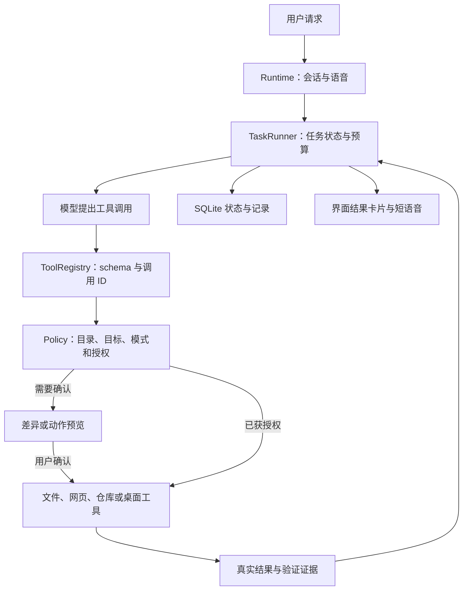

# Ayana 首批 Agent 能力实施方案

日期：2026-10-04。本文保留实施时的设计方案；实际实现、验收与尚未通过的项目见 [首批交付说明](FIRST_BATCH_DELIVERY.md)。基于当前工作区代码与 `docs/research/agent-capabilities-2026-10-04.md`。

## 1. 首批交付目标

完成三个真实场景：

1. “查这个报错的官方说明，把解决步骤保存成 Markdown。”Ayana 搜索、读取来源、整理内容、写入文件，再检查文件并展示打开入口。
2. “把这个配置里的端口改成 8080。”Ayana 读取完整文本、生成差异、等待用户选择，再应用、检查内容，并提供恢复版本的入口。
3. “在这个窗口执行下一步，然后告诉我有没有成功。”Ayana 提议动作、等待确认、执行，获得结果截图和控件信息，再验证和给出下一步。

首批范围是联网搜索、普通网页读取、UTF-8 文本文件创建/修改，以及有预算和确认机制的任务循环。长期事实记忆、提醒、通用命令执行、Office 编辑、浏览器登录操作与 MCP 属于后续批次。

## 2. 实现决策

| 项目 | 首批决定 |
| --- | --- |
| 运行方式 | 继续使用现有 Python Agent、SQLite、Electron/React 与原生 Windows 适配器 |
| 模型接口 | 保留现有 NDJSON 语音/翻译/工具事件；统一内部工具契约，为后续原生工具适配留入口 |
| 搜索 | 建立 `SearchProvider` 接口，首个适配器建议使用 Brave Search API |
| 网页 | `httpx` 抓取普通 HTML/纯文本，提取有界正文；动态网页明确返回能力限制 |
| 写文件 | 先支持文本；新建文件和修改现存文件分开处理，修改生成可复核差异 |
| 授权 | 服务端保存授权目录和目标，模型引用 ID；修改现存文件首批默认逐次确认 |
| 桌面动作 | 继续逐步确认，执行完把真实结果送回模型；每个新动作重新绑定有效目标与快照 |
| 任务 | 一次活动任务、串行工具执行、预算、等待确认、暂停、继续、取消 |
| 重启 | 保存任务状态；未完成任务标记为中断，展示记录，不自动重放写入或桌面动作 |
| 界面 | 呼出面板显示短进度与结果提示，管理窗口承载来源、文件、差异和任务详情 |

Brave 的官方接口提供搜索结果和独立 API 密钥认证，支持时间与语言参数。选择它主要是为了用现有 HTTP 客户端接入；本机网络连通、中文检索质量和账号可用性需要实施时验证。[Brave Web Search API](https://api-dashboard.search.brave.com/documentation/services/web-search)

搜索配置与模型配置分开。缺少搜索密钥时返回 `search_unconfigured`；用户给出网址时仍可以直接抓取。密钥使用独立环境变量或后端 DPAPI 存储，不写入公开配置、日志或模型输入。首批不需要用户更换现有对话模型；若实际模型无法稳定完成工具调用，再针对兼容性处理。

## 3. 核心架构

`runtime.py` 继续负责会话协调、模型连接和语音管线。新增 `TaskRunner` 负责工具往返与任务状态，不把全部新业务继续塞进 `_turn`。

第一步将现有 `read_file/search_text/list_files/capture_target/observe_controls` 注册为工具，保留旧名称别名。随后增加网页、文件和受确认的桌面执行工具。

## 4. 工具契约与执行

工具定义包含：名称、用途、输入/输出 schema、副作用类别、作用域要求、超时、可取消方式及重试条件。schema、实际校验和模型提示从同一份定义生成，避免手写列表漂移。

所有调用统一携带 `task_id/call_id/tool/arguments`。返回包含 `status/data/error/evidence`，状态区分 `succeeded/failed/partial/needs_verification`。错误使用稳定代码，界面显示中文解释；原始响应与凭证不直接回显。

模型只提出调用。服务端决定是否允许、是否需要确认、如何执行。模型返回的“已经批准”或网页中的指令都不构成授权。

调用请求超出预算时明确反馈；去掉现有 `requests[:4]` 静默丢弃剩余请求的行为。写入/提交失败后是否重试，由执行状态决定，不能一律自动重试。

### 工具清单

| 工具 | 参数摘要 | 结果与验证 |
| --- | --- | --- |
| `repository.list/read/search` | 所选目录 ID、相对路径、行范围或查询 | 保留现有源码过滤和读取边界；标明截断 |
| `web.search` | 查询、可选语言/时间/域名条件 | 来源 ID、标题、URL、摘要；日期缺失时标明未知 |
| `web.fetch` | URL 或来源 ID | 正文、最终 URL、获取时间、内容类型、截断与来源 ID |
| `files.read` | 已授权目录 ID、相对路径 | 完整有界文本、编码、版本哈希；部分读取不能用于整文件替换 |
| `files.create` | 输出目录 ID、相对路径、文本 | 创建结果、内容哈希、artifact ID；重新读取校验 |
| `files.propose_edit` | 目录 ID、路径、基准哈希、完整新文本 | 服务端保存 proposal，生成统一差异、有效期与 proposal ID |
| `files.apply_edit` | 已确认 proposal ID | 哈希冲突检查、备份、替换、重新读取校验 |
| `files.propose_restore` | artifact/版本 ID | 生成恢复差异，检查当前版本，走同一确认与应用流程 |
| `desktop.capture/observe` | 已绑定目标 ID | 有界图像及控件信息，新图片参与下一次模型输入 |
| `desktop.propose_action` | 动作、目标、快照、预期结果 | 服务端保存 action，展示具体动作与后果 |
| `desktop.execute_action` | 已确认 action ID | 结果截图、控件、发送/变化/验证状态；交回任务循环 |

`files.apply_edit` 和 `desktop.execute_action` 是执行入口，只有服务端验证用户确认后才能调用。renderer 提交 ID 和选择，不提交可随意更改的已批准内容。

首批文件编辑使用有界的完整文本替换，再由服务端生成差异；不要求模型生成包含准确行计数的补丁。读取不完整、编码不支持或文件超出限制时拒绝整文件替换，保留原文件。

## 5. 授权与文件一致性

### 目录与模式

- 所选仓库沿用只读语义；需要修改时，用户在管理窗口为指定目录授予文本写入范围。
- 默认产出目录为用户数据目录下的 `artifacts`；首次展示实际位置，也可以通过原生目录选择器更换。
- 日常文档目录与仓库目录分别授权；模型只能引用已存在的目录 ID，不能自行注册绝对路径。
- 教学模式允许观察、检索、预览差异与高亮；写入和桌面输入进入执行模式，检查与现有 `teach/execute` 一致。
- 执行模式中，在授权产出目录新建用户要求的文件可直接完成；目标已存在时转为修改预览，避免隐式覆盖。

目录 ID 由可信界面选择后在后端登记。所有路径规范化后检查范围；符号链接、junction/reparse point 和执行时路径变化都要处理。首批写入路径拒绝穿越链接或重解析点，并核验目标身份，不只做字符串前缀判断。

### 修改和恢复

1. 读取完整文本，记录原始字节哈希和目标身份。
2. 模型提出新内容；服务端生成并保存差异。
3. 用户确认 proposal ID；确认绑定内容哈希、任务和授权范围，内容变化必须重新预览。
4. 应用前检查文件、目录、模式、任务状态和授权是否仍有效。
5. 保存备份，写入同目录临时文件，完成后原子替换，再读取核对。
6. 恢复版本同样生成差异并检查当前文件，防止覆盖其他程序的新修改。

外部程序仍可能在检查与替换之间写入文件。实现时需要 Windows 文件句柄、共享模式和身份检查来收窄这个窗口；无法可靠处理的锁定文件返回明确失败，不能把预先比较哈希当成绝对一致性保证。

取消在落盘前阻止提交；已经进入不可分割的替换步骤时完成该步骤并记录实际结果，不声称撤销已完成。备份和任务记录设置容量/生命周期，不无限增长。

## 6. 联网内容与来源

网页正文和搜索结果始终作为不可信任务证据。只允许普通 HTTP/HTTPS 地址，验证解析后的地址和每次重定向；禁止 loopback、私网、链路本地地址及向这些地址的重定向。连接时要保证实际连接地址也是已检查的地址，避免只查一次 DNS 后再次解析。

下载采用流式读取，限制解压后的字节数和耗时。先支持 HTML/纯文本；移除脚本、样式和无关结构，再提取正文。具体正文提取库在实施时依据依赖、打包体积与页面样本选择。

搜索摘要只用于发现来源。网页加载失败、正文不足或动态内容不可用时明确返回，不补写未读取的事实。

服务端分配来源 ID，模型引用这些 ID；界面与保存文件从真实来源记录生成链接。第一批校验来源 ID 的存在与映射，不承诺自动证明每句话都由来源支持。验收时人工检查引用是否确实支持关键结论。

## 7. 任务、确认、暂停与取消

状态：`running/waiting_approval/paused/succeeded/failed/cancelled/interrupted`。

一个活动任务保存目标、模型轮次、调用账本、预算、待确认项、最近验证结果和文件记录。`task_id` 独立于语音 `generation_id`，但首批沿用当前新消息取消旧任务的行为，避免突然引入后台继续操作。后续再扩展任务中途补充指令与多任务。

等待用户确认时先收束当前短语音，关闭模型流，不挂着语音 worker 或让 HTTP 请求持续等待。保存可继续的完整轮次与 proposal；收到确认后核验并从执行结果继续模型调用。等待确认时间不计入实际执行时长。

暂停停在安全执行边界并冻结后续步骤；继续时重新检查目录/目标/快照/授权。取消清除待确认项、停止后续调用并通知原生输入适配器；同步线程的取消不能仅依赖 `asyncio` task cancellation。

桌面动作已具备输入后的截图和控件观察，优先复用这份结果，减少重复捕获。每个新动作重新绑定当前有效快照。状态必须区分：

- 输入已发送：证明 API 发送动作。
- 环境发生变化：证明看到了变化。
- 目标已验证：有文件/控件/当前图像证据支持目标达成。

任务完成需要对应验收结果；未知状态返回待确认或失败。模型不能单凭自然语言宣告把未知执行结果变成成功。

### 初始预算建议

以下数字是起始配置，不是性能承诺，实施时依据实测调整。

| 项目 | 起始配置 |
| --- | --- |
| 模型轮次/工具调用 | 每任务最多 12 轮、24 次工具调用，跨确认继续时累计 |
| 实际执行时长 | 每任务 180 秒，排除用户确认与暂停的等待时间 |
| 联网读取 | 每请求最多 25 秒，正文下载最多 2 MiB，提取后给模型最多 12,000 字符 |
| 搜索结果 | 默认 5 条，单次最多 10 条 |
| 文本文件 | 首批完整编辑不超过 64 KiB；生成内容同时受单事件/模型输出预算限制 |
| 图像 | 统一像素、编码字节和快照总内存预算，保留坐标转换；具体上限按截图样本实测确定 |
| 语音 | 每段进度使用现有短句管线；完整任务结果放在卡片/文件，不塞进语音 |

模型目前输出预算为 2,200 tokens；新增有界配置支持文件产出，并验证单事件 64 KiB 解析上限。收到截断输出时不能执行半个写入调用，也不能通过续写重复执行此前调用。

## 8. 存储、协议与界面

SQLite 新增 `tasks/tool_calls/proposals/artifacts/sources`。备份内容以文件保存，数据库记录版本与哈希。初始化采用可重复执行的迁移，保留现有历史。

`save_history=false` 时，模型轮次、来源正文和任务对话保持内存语义。已落盘文件及必要的恢复元数据单独说明和管理，不将完整对话绕过设置持久化。任务关闭/重启后不静默继续有副作用的操作。

协议首批保留版本 1，通过新增事件与字段扩展，并同步 Python schema、TypeScript 类型和 Electron 命令白名单。新增内容包括：

- 事件：`task.updated`、`approval.required/resolved`、`artifact.ready`、`source.ready`。
- 命令：`task.pause/resume/cancel`、`approval.resolve`、`artifact.get`。
- 工具事件增加 `task_id/call_id`，结果图像和大文本使用有界载荷或后端资源引用。

修正 reducer 对“语音取消等于任务 idle”的假设；过期任务/调用事件不能改变新任务状态。界面重新连接时获取当前任务与待确认项的快照，不只等待未来事件。

呼出面板维持现有立绘和对话：增加短进度条目、任务状态与结果入口。管理窗口增加任务详情、来源卡片、文件卡片和差异预览，明确展示暂停、继续、取消及确认/拒绝。

打开文件通过 Electron 的受限 IPC 实现：renderer 传 artifact ID，主进程从可信记录解析路径并核验。首批只打开登记的文本文件；外部链接只允许经过校验的 HTTP/HTTPS URL。不得让模型传任意路径或命令给系统打开接口。

为保护语音和取消响应，增加有界事件广播与单写入者持久化；最终任务/写入结果需可靠落盘。记录队列失败时，停止继续副作用并报告状态，不无限丢弃关键结果。

## 9. 文件改动范围

| 模块 | 新增或修改 |
| --- | --- |
| 工具核心 | 新增 `tools/registry.py`、`tools/policy.py`、`tools/contracts.py`，迁移 `_read_tool` 分支 |
| 联网 | 新增 `tools/web.py` 和搜索 provider 适配器 |
| 文件 | 新增 `tools/files.py`，保留 `repository.py` 的源码过滤语义 |
| 任务 | 新增 `tasks.py`，修改 `runtime.py/context.py` 的工具结果回传和确认后继续 |
| 存储/配置 | 修改 `storage.py/config.py/credentials.py/config/default.json`，加入迁移、预算、搜索凭证与敏感字段过滤 |
| 协议 | 扩展 `packages/protocol` 的工具、任务、授权、文件和来源契约 |
| 桌面主进程 | 修改 `main.ts/preload.ts` 的目录选择、文件打开和命令白名单 |
| UI | 修改 `renderer/types.ts/state.ts/App.tsx`，按现有样式添加任务/来源/文件/差异组件 |
| 发布 | 更新 `pyproject.toml`、后端打包脚本与打包验证，确保新依赖在独立 Python 中可导入 |
| 政策 | 更新 `characters/ayana/agent-policy.md`，明确联网证据、文本写入、任务完成与授权边界 |

## 10. 开发顺序与阶段验收

按可独立审查的改动推进，已有未提交修改先核对，不覆盖或回退无关工作。

| 顺序 | 交付 | 阶段验收 |
| --- | --- | --- |
| 1 | 工具契约、注册器、输入校验、范围授权 | 旧的仓库工具和教学高亮可用；未知工具与不合法参数被明确拒绝 |
| 2 | 任务状态、预算、调用账本、确认后继续、最新截图回传 | 模型确实得到新图片；桌面动作的真实结果进入下一轮；拒绝/取消后不继续操作 |
| 3 | 文本创建、修改预览、应用、恢复、文件卡片 | 文件真实落盘；外部修改产生冲突；已有文件不被隐式覆盖；恢复可核验 |
| 4 | 搜索、网页读取、来源记录与设置 | 有密钥时真实搜索；无密钥时明确提示并可读指定 URL；来源链接可打开 |
| 5 | 交互整合、事件队列、存储生命周期和发布验证 | 三个首批场景在桌面界面完成；语音打断与快捷键可用；发布包能运行 |

执行场景 3 的真实测试使用项目现有练习窗口。网页与文件样本使用公开资料和临时目录，避免对用户日常软件执行实验步骤。

## 11. 必须通过的验证

- 单元与集成：路径越界、Windows junction/reparse point、参数和权限、文件冲突、备份恢复、预算、取消、重连和重启。
- 网络：超时、错误密钥、限流、动态网页、截断、重定向至内网、DNS 地址变化；测试不依赖真实付费请求，最终另做小量真实 API 验证。
- 工具/模型：无效事件不执行、重复 call ID 不重放、写入后响应丢失不重复覆盖、新图像真实进入下一请求、确认后结果真实进入模型上下文。
- UI：语音取消与任务状态分离、过期事件过滤、差异确认与拒绝、文件打开限制、来源卡片、重新连接恢复待确认信息。
- 回归：现有 Python 测试、桌面测试和 TypeScript/build；语音、服装/表情、快捷键和透明窗口人工冒烟。
- 交付：三个端到端场景通过，来源支持关键结论，文件内容与哈希可核验，单步动作有明确观察证据。

## 12. 实施前外部条件

本机需要一个可用的联网对话模型配置；搜索需要额外的 Brave Search API 凭证和连通性验证。可以先完成工具、任务和文件开发，使用测试替身验证流程；真实搜索与最终发布验收必须使用实际可用凭证。

这一批完成后，Ayana 应能稳定交付一件小任务的结果，并为第二批记忆和提醒提供任务与数据基础。
