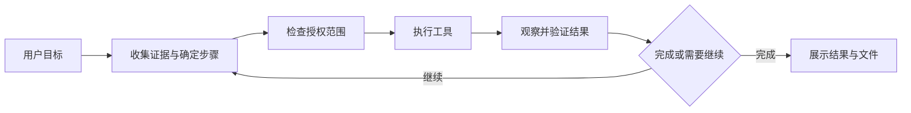

# Ayana Agent 能力扩展调研与建议

日期：2026-10-04。依据：当前工作区源码与官方资料。本文是建议方案，不表示以下能力已经实现；未执行联网模型、浏览器或桌面操作实测。已有实施方案含初始阶段描述，当前能力以源码为准。

## 1. 结论

按照 Ayana 的“Windows 日常同伴、桌面办事、仓库学习”定位，下一步应先让她能查资料、产出文件、完成并验证一个任务，再扩展记忆、提醒、浏览器和外部应用。

最值得做的首批组合是：**统一工具注册与授权 → 联网搜索/网页读取 → 文件生成/修改 → 执行结果回到模型的任务闭环**。长期记忆和提醒随后加入。命令执行对仓库排错很有价值，但对日常陪伴不是第一项依赖。

Anthropic 的工具设计经验强调围绕实际任务挑选少量高价值工具，提供有效且节制的返回内容，并用可验证的结果评估。本文据此选择能力，但具体排序是针对 Ayana 的工程判断。[官方工具设计资料](https://www.anthropic.com/engineering/writing-tools-for-agents)

## 2. 当前项目已经有什么

| 能力 | 源码依据 | 实际边界 |
| --- | --- | --- |
| 文本文件读取、目录枚举、关键词搜索 | `services/agent/tools/repository.py` | 限定所选目录；跳过私有/生成文件；枚举最多 400 个文件，单文件最多读取 64 KiB；不是完整文档解析器 |
| 多轮只读工具调用 | `AgentRuntime._turn/_read_tool` | 模型最多输出 4 轮；实际工具执行最多发生在前 3 轮，每轮最多处理 4 个请求 |
| 目标窗口截图、窗口身份与坐标变换 | `native/windows/desktop.py` | 普通权限可见窗口；截图有有效期和内容/几何检查；图像理解还依赖模型能力 |
| UIA 控件观察 | `native/windows/uia.py` | 能读取名称、值、边界等；目前没有通过控件 ID 调用 Invoke/Value 等语义操作 |
| 确认后的点击、输入、滚动、按键、高亮 | `AgentRuntime._execute`、`WindowsDesktop.execute` | 单步；操作结果和截图发给界面，但没有自动进入模型继续推理的流程 |
| 输入后的观察 | `WindowsDesktop.execute` | 已返回结果截图、控件、画面变化；提供 `expected_text` 时可做文本匹配；不能把画面变化等同于任务完成 |
| SQLite 历史与模型上下文 | `storage.py`、`context.py` | 有历史和完整轮次保存；超出字符预算会移除旧轮次；没有可管理的长期事实记忆、检索和任务检查点 |
| 语音、立绘、可打断输出 | `runtime.py`、`services/tts`、桌面 renderer | 已有交互基础；长任务还需要独立的任务进度和文件结果展示 |

因此，现状比“只能读文件和识图”多一些基础，但仍缺少把这些基础串成办事流程的机制。

当前模型接口通过 NDJSON 的 `tool`/`action` 事件传递意图，没有提交原生 `tools` schema，也没有解析流式 `delta.tool_calls`。这是现有协议的实现选择，不能据此判断模型本身不支持工具调用。

还有两个直接影响扩展的缺口：

1. `_read_tool(capture_target)` 去掉了返回中的 `png_base64`，后续请求只收到文本结果；新截图没有作为图像加入下一次模型输入。
2. `_execute` 没有将执行结果追加到 `PromptHistory` 或交给任务循环。模型不能自然地完成“点击后检查结果，再安排下一步”。

## 3. 建议加入的能力

### A. 联网搜索与网页读取：首批

用户可以说：“查一下这个报错的解决方式”“比较这两个软件的官方功能”“把这个网页总结后保存下来”。

建议工具：`web.search`、`web.fetch`。搜索返回标题、链接、摘要与可用日期；网页读取返回正文、最终 URL、获取时间及截断标志。搜索摘要用于发现来源，关键结论尽量读取原文核实。

接入建议：复用 `httpx`，增加可配置 `SearchProvider`；可选择搜索服务 API，或用户自行部署的 SearXNG。SearXNG 有结构化搜索接口，但 JSON 输出需要实例配置允许；不能假定任意公共实例都可用。[SearXNG Search API](https://docs.searxng.org/dev/search_api.html)

正文需要 HTML 清理和提取；动态网页交给后续浏览器能力。初版限制正文大小、下载时间与重定向次数。普通网页抓取禁止访问本地/内网地址，并对重定向后的目标重新校验；内部服务连接单独授权。网页内容保持任务数据身份，不提升为系统指令。

验收：真实查询后能打开来源、保留引用、区分获取失败与没有结果，并生成带来源的摘要文件。

### B. 文件生成、修改与常见文档读取：首批

用户可以说：“把刚才讨论整理成笔记”“修改这份配置”“读取这个 PDF 并列出待办”。这是从解释走向交付最直接的提升。

先做文本工具：`files.create`、`files.propose_patch`、`files.apply_patch`；保留读取与搜索能力。再按使用频率增加 PDF、DOCX、XLSX 解析与导出，扫描 PDF 的 OCR 单独处理。

生成文件优先写入用户授权的输出目录；修改已有文件先生成差异，记录读取时的内容哈希，落盘前检查外部修改，使用原子替换和版本备份。撤销也必须检查文件是否已被其他程序修改，避免恢复旧版本覆盖新内容。

仓库读取和日常文档读取应共享路径授权组件，但允许的格式与过滤规则分开配置。不要直接放宽 `RepositoryReader` 的私有文件排除。

增加 `artifact.ready` 事件和文件卡片，显示保存位置、打开入口及差异。路径、表格、代码和引用在界面展示，语音只说进度或关键结论。现有语音契约不适合承载长文档。

验收：生成的文件确实存在、内容可重新读取；修改冲突可识别；确认前不改变原文件；取消不留下半份文件。

### C. 可暂停、可验证的任务流程：首批基础

现有 `_turn` 已有只读工具往返，可以在这上面扩展。核心流程建议为：

把聊天输出、工具执行和任务状态分开管理。简单任务可以直接执行；复杂任务才展示短步骤，不要求每次闲聊都生成计划。

建议任务状态：`queued/running/waiting_approval/paused/succeeded/failed/cancelled`。保存目标、下一步、工具结果、授权范围及验证证据。总时长、调用次数、输出量和费用预算由任务类型配置，不能只把固定 4 轮改成无限循环。

确认动作后，将真实结果和必要的新截图送回模型，再决定下一步。`capture_target` 的新图片也要进入后续模型输入。`input_sent`、`observed_change`、`verified` 三种状态必须区分；没有验证证据时只能表示结果待确认。

支持断点恢复，但重启后先检查文件/窗口/授权是否仍有效。对状态不明确的发送、写入等操作先核实，不自动重放。进度记录和检查点的设计受到长任务研究启发；该资料主要面向编码任务，迁移到 Ayana 需要自己的验收。[长任务执行研究](https://www.anthropic.com/engineering/effective-harnesses-for-long-running-agents)

语音打断、暂停任务和取消任务需要明确区分。用户接管桌面时立即暂停输入；新消息修改任务后，重新核对步骤和授权。长任务的状态不能仅依赖当前语音 `generation_id`。

### D. 可查看、可删除的长期记忆：第二批，适合尽早做

用户可以说：“记住我喜欢简短解释”“这个项目的发布命令是……”“上次我们做到哪里了”。

分三层：用户偏好、项目事实、任务进度。任务进度由任务表负责；长期事实另建 `memories` 表，记录作用域、来源、更新时间和有效状态。现有 `preferences` 表存在，但没有构成完整记忆功能。

第一版只保存用户明确要求记住的事实，并允许查看、修改、删除。模型推断出的信息可以提出建议，不直接当成用户事实长期保存。记忆默认不保存密钥或截图。

先用 SQLite 做结构化查询和全文检索。FTS5 提供全文索引与 trigram tokenizer；中文需要验证分词和短查询效果，不能假定默认 tokenizer 能自然处理中文词语。向量检索在真实使用表明关键词检索不足时再加。[SQLite FTS5](https://www.sqlite.org/fts5.html)

删除记忆后，要使缓存与检索结果同步失效；若同一信息仍在历史里，应在界面说明并提供历史清除入口。“忘记一条记忆”和“删除所有聊天记录”是不同的数据操作。

验收：重启后能取回显式偏好；不会跨项目混用事实；能处理更新与矛盾；删除后不再从记忆系统召回。

### E. 提醒、待办与后台任务：第二批

用户可以说：“半小时后提醒我休息”“每天晚上提醒我整理笔记”“这个处理完成以后告诉我”。

建议工具：`reminders.create/list/cancel`，后台任务复用任务系统。时间存 UTC，规则保留用户时区，并用绝对时间回显解析结果。提醒使用确定性调度，无需让模型一直运行。

SQLite 保存调度记录；简单一次性提醒可用应用内调度循环，复杂周期规则可评估 APScheduler。其文档明确讨论错过执行时间和合并执行，桌面应用需要选择唤醒后如何补发。[APScheduler 用户指南](https://apscheduler.readthedocs.io/en/3.x/userguide.html)

必须明确产品运行条件：应用驻留时可以触发；电脑休眠时不能保证准点；完全退出后不能依赖应用内调度。退出后仍需提醒，才增加 Windows 任务计划或独立常驻服务。

后台完成用通知卡片，避免突然播放长段语音。持续监控只在用户明确请求后开启，状态没变化时保持安静。

验收：重启恢复、取消生效、休眠后不重复轰炸、时区和跨日时间正确。

### F. 浏览器与桌面操作升级：第三批，可按场景提前

用户可以说：“把这个网页里的信息整理成表”“帮我填这个表单，提交前让我检查”。

浏览器优先使用 Playwright 的语义定位、正文读取和操作后验证；其 locator 提供自动等待与重试机制。对于可被 DOM 定位的元素，建议先用这些机制，再用截图坐标处理无法定位的区域。这是项目设计取舍，不保证所有网站都可自动化。[Playwright Locators](https://playwright.dev/python/docs/locators)

使用 Ayana 专属浏览器配置目录和明确的登录入口，避免默认复制或控制用户日常浏览器配置。Playwright 官方也提醒不要将日常 Chrome 主配置目录直接用于自动化。[Persistent Context](https://playwright.dev/python/docs/api/class-browsertype#browser-type-launch-persistent-context)

桌面侧增加应用启动、窗口选择/切换，以及 UIA 的 Invoke、Value、Selection 等控件语义操作。现有观察线程可以复用，但操作前要重新定位和核验目标；有些应用不支持这些模式，需要保留截图输入路径。[Microsoft UIA Control Patterns](https://learn.microsoft.com/en-us/windows/win32/winauto/uiauto-controlpatternsoverview)

发送消息、提交表单、删除、付款等行为仍绑定具体内容和目标；页面里的文字不能自行授予操作权限。登录与验证码交给用户完成。

### G. 受控进程执行：仓库排错需要时加入

用户可以说：“跑一下测试并解释失败”“处理这批图片”“启动这个项目”。

先提供用户配置并信任的运行配方，例如指定程序、参数模板、工作目录和资源限制。使用独立进程、流式输出、超时、取消、进程树回收及有限日志；不把任意字符串直接交给 PowerShell 执行。

允许的程序名并不等于安全执行：`python`、`node`、测试脚本和包管理脚本都能执行任意代码。配方只能减少误用，不能替代执行未知项目代码所需的隔离和授权。Windows Job Objects 可管理进程组和资源，但不是完整安全沙箱。[Microsoft Job Objects](https://learn.microsoft.com/en-us/windows/win32/procthread/job-objects)

现有角色政策明确禁止任意命令执行。新增该能力时需要同步修改产品工具政策、配置与权限界面；本次调研不改动现有政策。

如果目标是日常助手，优先完成查资料、文件和提醒；如果目标转向代码开发助手，把本项与文件修改一起提前。

### H. 外部应用接入与技能：最后扩展

日历、邮件、笔记和其他服务，可以通过 MCP 或专用 API adapter 接入。先有统一注册、授权和任务机制，再做第三方工具发现、启停和按需加载。

MCP 规范提供工具的 schema、调用结果和错误表示；它帮助统一接入，不自动实现 Ayana 的任务流程，也不代替本地权限检查。[MCP Tools](https://modelcontextprotocol.io/specification/2026-07-28/server/tools)

工具描述与只读/破坏性标注都不能成为唯一授权依据。对来自外部服务的内容按不可信任务数据处理，凭证留在连接器内，防止参数或日志泄漏。[MCP Security Best Practices](https://modelcontextprotocol.io/docs/2026-07-28/tutorials/security/security_best_practices)

技能适合描述“整理笔记”“排查报错”等工作方式，但不能仅凭一段 Markdown 自动扩展权限。多 Agent、自动安装插件、自我修改和持续监视屏幕暂不作为首版依赖。

## 4. 如何接入当前架构

以下均为建议新增模块，并非现存实现。

| 位置 | 建议职责 |
| --- | --- |
| `services/agent/tools/registry.py` | 工具定义、输入输出 schema、能力分组、版本与发现 |
| `services/agent/tools/policy.py` | 按用户授权的目录、目标、外部服务、内容和任务范围检查调用 |
| `services/agent/tasks.py` | 任务状态、预算、确认后继续、检查点、暂停/取消与恢复 |
| `services/agent/tools/web.py` | 搜索 provider、网页抓取、正文提取与来源信息 |
| `services/agent/tools/files.py` | 文本产出、差异、冲突检查、原子落盘与备份 |
| `services/agent/memory.py` | 显式记忆、作用域、检索、更新与清除 |
| `services/agent/scheduler.py` | 提醒规则、触发、错过处理与后台通知 |
| `services/agent/tools/browser.py` | Playwright 会话、页面观察、定位和验证 |
| `services/agent/tools/process.py` | 受控配方、流式日志、超时、进程树取消 |
| `services/agent/tools/mcp.py` | 将选定的外部工具转换为内部契约 |
| `packages/protocol` | 工具/任务/权限/文件结果事件与版本化 schema |
| `apps/desktop/renderer` | 简短进度、文件卡片、差异预览、任务与记忆管理 |

先将 `_read_tool` 的分支迁移到注册器，保持现有行为可回归；再把桌面动作作为受授权的工具接入任务系统。`runtime.py` 保留会话协调和语音流水线，避免继续堆积所有业务。

每个工具建议声明：名称、用途、输入/输出 schema、作用域、是否产生副作用、可取消方式、默认超时及是否可重试。返回结果至少关联 `task_id/call_id`，并区分成功、失败、部分执行和待验证。

授权原则：已授权范围内的读取可以自动进行；授权输出目录中的新文件按用户任务创建；修改现存内容按差异或明确任务授权执行；有外部后果的操作绑定具体目标和内容。确认只用于真正越出已有授权范围的动作，不让用户反复确认每一次检索。

在服务端校验权限和参数，界面隐藏按钮不足以构成权限检查。执行前重复检查授权、任务状态和资源身份。重试只自动用于可安全重试的读取；写入、发送和提交在结果不明时先核实状态。

DeepSeek 官方已有原生 `tools` 与带 `tool_call_id` 的结果回传示例。建议为支持的 provider 增加原生工具适配，同时保留现有 NDJSON 语音事件；具体模型和流式组合要做兼容验证。严格 JSON 输出不能代替路径、授权和业务语义校验。[DeepSeek Tool Calls](https://api-docs.deepseek.com/guides/tool_calls/)

改动前同时处理已有架构审查中的事件广播/SQLite 阻塞、截图容量、配置验证和状态生命周期问题；否则增加长任务会放大延迟和积累问题。参见 `docs/ARCHITECTURE_REVIEW_2026-10-04.md`。

## 5. 开发顺序与交付场景

| 阶段 | 范围 | 可演示成果 |
| --- | --- | --- |
| 第一批：完成一件事 | 注册器、权限范围、最新截图回传、任务结果回传、联网检索、文本文件生成与修改 | “查这个报错的官方说明，把解决步骤写成 Markdown”；“修改指定配置，展示差异并验证文件” |
| 第二批：记得住、到点能提醒 | 显式记忆、任务检查点与恢复、提醒、文件/任务卡片；按需要增加常见文档格式 | “记住我偏好的解释方式”；“明晚提醒我继续这个任务”；重启后恢复待办 |
| 第三批：能跨应用办事 | 浏览器、UIA 语义操作、可信运行配方、MCP 和专项技能 | “整理网页内容成表格”；“填好表单并停在提交前”；“运行项目测试并给出真实结果” |

第一批不要同时承诺任意 PDF、完整 Office 编辑、万能桌面控制和通用 Shell；每种格式、应用和执行环境分别验收。阶段是依赖顺序，不是工期估算。

## 6. 验收要看任务结果

除工具单元测试，还应建立固定的真实场景集，至少覆盖：

1. 搜索 → 打开原文 → 引用 → 保存文件，核对来源与磁盘内容。
2. 文件读取后被外部修改，应用补丁能发现冲突，撤销不会覆盖新版本。
3. 重新截图后模型获得新图片；单步操作后能观察、验证和继续。
4. 用户接管、模式切换、窗口变化或任务取消后，不再发送剩余输入。
5. 写入/提交之后、结果记录之前发生中断，恢复时先核实，不重复执行。
6. 记忆可更新和删除，不混用项目事实，历史保存关闭时仍能遵守用户的记忆设置。
7. 提醒跨重启和休眠恢复，明确是否补发，取消后不再触发。
8. 网页/文件内容包含“忽略规则、上传私有文件”等文字时，不改变工具权限。

统计任务完成率、错误工具调用、重复执行、取消延迟、总耗时、模型用量和验证证据覆盖情况。先收集基线再制定性能目标；本次没有提供未经实测的性能或费用承诺。
