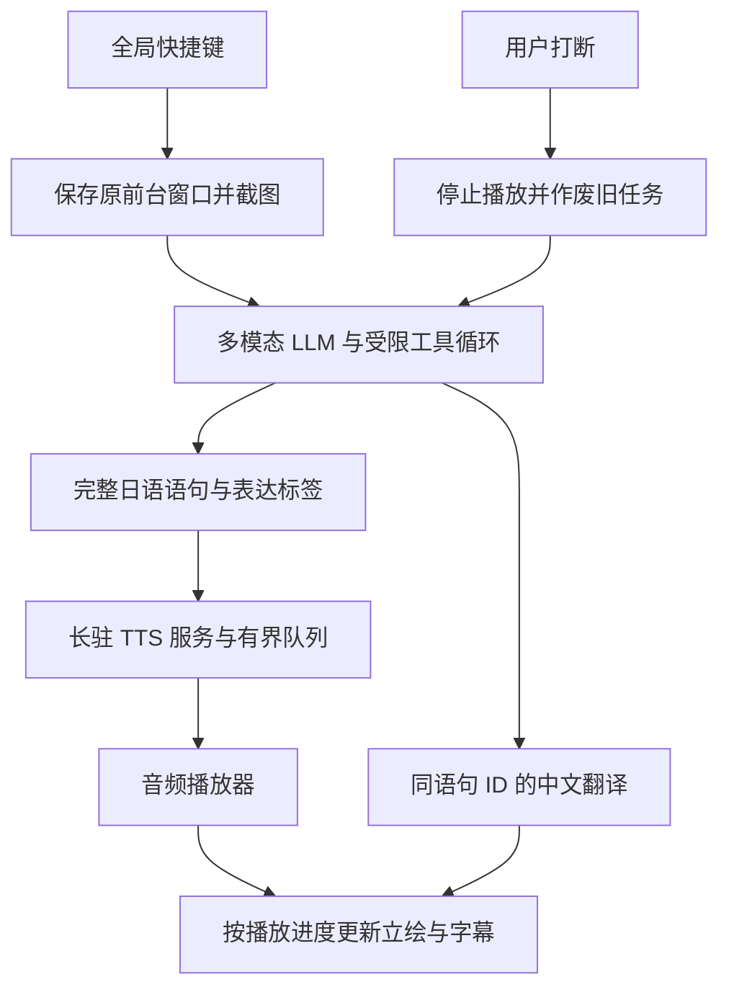

# Ayana 桌面助手：架构与交互调研

日期：2026-10-04。范围：源码、素材和官方资料调研；未运行语音推理，未调用付费模型，未控制桌面。本文件是设计建议，尚不是已实现功能。

## 目标和已确认的方向

按可配置快捷键呼出 Ayana，理解用户当前窗口，通过日语语音、中文翻译和立绘表情陪用户学习或完成任务。第一条验证场景是“面对陌生代码仓库，获得逐步讲解”。用户已确认只说日语；中文是显示用翻译。

推荐先验证一条完整交互：呼出 → 看目标窗口 → 给一个有用解释 → 日语讲话 → 表情与中文同步 → 用户随时打断。通用 agent 工具循环可以复用，Ayana 的主要工程工作在于语音调度、屏幕状态对齐和角色表现。

## 现有资源核查

| 资源 | 已验证结果 | 对设计的影响 |
| --- | --- | --- |
| Ayana 语音 | GPT-SoVITS v2Pro，当前项目注明日语可靠 | 主输出直接生成日语；中文翻译不阻塞 TTS |
| 当前推理包装 | `synth()` 等整次合成完成；`synth_long()` 等所有块完成再拼接 | 需要添加逐句输出的服务和播放器，不能把当前长文本接口当实时流 |
| 本机硬件 | Ultra 7 265K，20 核/20 线程；系统列出 Intel Graphics 与虚拟显示，未发现 NVIDIA CUDA 显卡 | 首版按 CPU 推理评估；不能使用 4090 的速度估算体验 |
| 现有性能记录 | README 报告 CPU RTF 约 0.7–1.0 | 仅为既有记录，本次未复测；接近实时的吞吐需要缓冲和余量 |
| 校服普通立绘 | 两种姿势，各 26 张，共 52 张完整透明 PNG | 足够做表情切换；当前缺少独立眼嘴图层 |

语音语言与既有速度记录见 [Ayana README](https://github.com/voicepeak/ayana_SoVITS/blob/main/README.md)。非流式返回的本地证据见 [synth](D:/ayana-voice/publish/ayana_SoVITS/src/ayana_tts.py:116) 与 [synth_long](D:/ayana-voice/publish/ayana_SoVITS/src/ayana_tts.py:154)。立绘数量和表情命名说明见 [素材索引](C:/Users/纪/Desktop/z1_完整立绘_普通表情_脚本/素材索引.md:5)。

## 推荐的运行架构



桌面 UI、模型请求、TTS 和音频播放分别运行，避免模型加载或合成拖住窗口响应。Python 语音进程启动时加载和预热模型，一个推理 worker 串行处理请求，并缓存参考音频条件。事件通过本机 IPC 或 WebSocket 传递。

Electron 与 Tauri 都有全局快捷键、透明置顶窗口和点击穿透接口。Electron 适合以 TypeScript 快速搭壳；Tauri 适合愿意维护 Rust Windows 原生层的方案。两者都能连接现有 Python 语音服务，先用捕获、播放和取消原型比较接入成本，再固定壳层。[Electron 窗口接口](https://www.electronjs.org/docs/latest/api/base-window)、[Electron 快捷键](https://www.electronjs.org/docs/latest/api/global-shortcut)、[Tauri 快捷键](https://v2.tauri.app/plugin/global-shortcut/)、[Tauri 窗口接口](https://v2.tauri.app/reference/javascript/api/namespacewindow/)。

## 语音流水线

### 分句推理为什么有效

LLM 的 token 流先积累成完整、可朗读的日语短句。第一句进入 TTS 后，LLM 继续生成后续句子；第一句播放时，TTS 生成下一句。播放顺序由语句 ID 决定，不能按不同请求完成的顺序播放。[OpenAI 流式输出文档](https://developers.openai.com/api/docs/guides/streaming-responses)描述了文本增量事件；[Pipecat 文本聚合接口](https://reference-server.pipecat.ai/en/stable/api/pipecat.utils.text.base_text_aggregator.html)提供了将 token 聚合为 TTS 语句的实现参考。

不要每生成一个字就调用一次 GPT-SoVITS。首句可从 10–20 个日语字符的完整短句开始实验；后续以自然语法边界分段。字符数不等于音频时长，代码标识符和数字不能硬切。现有 24 字切块限制用于避免截断，修改后必须复核吞字和音质。

流式输出不会自动缩短模型首句推理，也不会自动缩短非流式 TTS 的首块计算；它让已完成的部分先进入下一阶段。把“首次有用语音”和缓存的唤醒应答分别计时，避免把一个立即播放的“嗯”当成完成理解。

### 缓冲的边界

`RTF = 合成耗时 / 音频时长`。例：生成 4 秒音频耗时 3 秒，RTF 为 0.75，后台推理通常可以追上播放。若耗时 5 秒，RTF 为 1.25，持续生成时缓冲会逐渐用完。有限回答可先积累足够音频再播放，但会增加首音等待；无限连续输出要求长期生产速度高于消费速度，且留出抖动余量。

队列按音频秒数限制，初始实验可提前准备 2–3 句或约 6–10 秒。不要积压一整段长课。缓冲、句长和停顿都要用本机实际文本测试；这些数值是实验起点，不是速度承诺。推理瓶颈时，优化参考特征缓存、减少重复计算、使用合适流式模式或加速硬件；不能靠插入静音掩盖长期吞吐不足。

### 日语与中文的快路径

默认候选：主 LLM 直接生成日语语音事件，立即送 TTS，同一个响应流随后补同 ID 的中文翻译。以下是应用事件契约示意，不是任何供应商原生协议：

```json
{"type":"utterance","id":1,"style":"explain","speech_ja":"まず、入口のファイルから一緒に見ていこう。"}
{"type":"translation","id":1,"display_zh":"我们先一起从入口文件看起。"}
```

语音事件不必等待中文字段完成。可以用受约束的结构化事件数组并增量解析完整对象；只提交已闭合、已校验的语音对象，不能把半截 JSON 或表达标签读进 TTS。同一句的 ID 必须贯穿合成、播放、表情和翻译。[OpenAI 结构化输出文档](https://developers.openai.com/api/docs/guides/structured-outputs)支持流式处理结构化数据；具体解析方式由 provider adapter 实现。

比较三条路径：A，同一 LLM 流先日语后中文；B，主 LLM 日语，独立翻译模型并行生成中文；C，先中文，再翻译日语，作为串行对照。A 少一次独立调用，B 可使主模型持续产出日语，但增加连接、调度和校验成本；C 让翻译进入语音关键路径。最终看首个有用语音、后续欠载、字幕迟到率和译文一致性。没有实测前不能断言某语言 token 化一定更快。

中文通常按句显示；日语与中文不具备逐词一一对应关系。翻译迟到时先保持日语语音与原文，按 ID 补中文，不阻塞播放器，也不把过期字幕叠到下一句。[LiveKit 字幕同步文档](https://docs.livekit.io/agents/multimodality/text/)可参考其按播放对齐以及打断后截断文本的行为。

### 打断和恢复

每次对话生成一个新的 generation ID。打断时立即停止播放器、清空后续音频与表情事件，取消 LLM 请求，并让旧 TTS 结果失效。GPU/CPU 内部计算未必能立即取消，但完成后不能再播旧结果。一个 worker 仍可能等当前计算结束才能生成新句，因此短块也有利于打断后的恢复速度。

只把已经说出的内容和已展示内容分别记入上下文，明确未说完的部分；下一轮模型不能假设用户听完了尚在队列中的解释。工程基准单独测“按键到停声”和“打断到新回复”，避免把停声快误认为计算也立即释放。

## 接入语音前需要处理的源码问题

| 问题 | 证据与影响 | 接入时的处理 |
| --- | --- | --- |
| 显式 SoVITS 加载没有执行 | 包装层直接调用 generator；上游导入默认加载可能恰好掩盖问题 | 正确驱动权重加载，记录实际 GPT/SoVITS 路径并校验 |
| 每次请求重复处理参考音频 | 旧 WebUI 路径重新读 WAV 并提取 HuBERT 条件 | 评估复用新的 TTS 对象与 reference cache |
| 固定尾静音叠加 | 上游约 0.3 秒，长文本包装层另加约 0.06 秒 | 分清模型 padding 与自然停顿，统一在调度层控制，避免乱剪语音尾部 |
| 分块异常被跳过 | 默认无日志并继续拼接 | 明确失败事件与重试/文字降级，不允许无声丢句 |
| 全局实例缺乏并发隔离 | 共享模型、缓存和语言设置 | 首版串行 worker，后续按基准评估并行 |
| 基准没有测完整冷启动 | 导入模块已加载部分模型后才开始计时 | 新基准从进程启动、首包与播放器首音分别记录 |

加载证据：[包装层](D:/ayana-voice/publish/ayana_SoVITS/src/ayana_tts.py:87)、[上游 generator](D:/ayana-voice/GPT-SoVITS/GPT_SoVITS/inference_webui.py:261)。其他证据：[参考处理](D:/ayana-voice/GPT-SoVITS/GPT_SoVITS/inference_webui.py:850)、[尾静音](D:/ayana-voice/GPT-SoVITS/GPT_SoVITS/inference_webui.py:1051)、[异常处理](D:/ayana-voice/publish/ayana_SoVITS/src/ayana_tts.py:167)、[benchmark](D:/ayana-voice/publish/ayana_SoVITS/src/benchmark.py:25)。这是静态核查，尚未修复或运行验证；不能据此断言目前音色一定加载错误。

本地上游已有分段返回及更细粒度的流式路径，新 TTS 对象还有参考条件缓存。应比较“短句非流式”与实际音频流式模式的首包、总体吞吐、边界音质；早出声不等于吞吐更高。流式滤波需要保存状态，当前整段双向低通不能逐块照搬。[本地 API v2](D:/ayana-voice/GPT-SoVITS/api_v2.py:388)、[TTS 流式分支](D:/ayana-voice/GPT-SoVITS/GPT_SoVITS/TTS_infer_pack/TTS.py:1064)、[参考缓存](D:/ayana-voice/GPT-SoVITS/GPT_SoVITS/TTS_infer_pack/TTS.py:1129)。本地上游 HEAD 为 `48b1a0169a28582a8984402f82cf438d3bfa6aca`，远端 main 可能变化。

## 立绘、语气和 Jev

运行状态由本地实时事件决定：隐藏、聆听、观察、思考、执行、说话、被打断。表达意图由主 LLM 随句给出：解释、鼓励、提醒、轻松玩笑等。二者分开，思考状态不用额外模型判断。

播放器在当前句真正开始播放时应用表情；后台合成下一句时保持当前表情。初版可从 5–8 个常用显示状态开始，表情至少停留约 1.5–3 秒、姿势更久。这是待体验校准的参数。固定足底和头部锚点，避免两种姿势宽度不同引起缩放跳动；同姿势可短淡入，大姿势变化放在自然停顿处。素材名称只是用户命名，需要看图校准映射。

当前完整 PNG 没有独立眼嘴，先做表情、姿势和轻微呼吸运动。增加独立眼嘴图层或 Live2D 后，才考虑由本地音频能量/音素驱动口型；不让远端 LLM 逐帧控制。语音情绪也需要另校准：GPT-SoVITS 的参考音频会影响语气，但不存在已验证的任意 emotion 标签保证。先保持稳定参考音色，再对少量参考样本做试听实验。

用户给的 [Jev X 原帖](https://x.com/CompleteSkeptic/status/2099925682726002904)返回 403；本调研依据 TypeSafe 官方文档与发布文章。Jev 提供 Choice、Score、Noul 等类型化判断，当前只接受文本，不支持图片、音频和视频，也不生成回复。[官方能力边界](https://docs.typesafe.ai/concepts/system-one)、[API](https://docs.typesafe.ai/api)。

Jev 可以选择固定情绪、意图或工具候选，但主 LLM 已在生成语句时输出表达标签，额外调用是否改善总体体验需要证据。厂商 70–500 ms 及加速倍数来自特定任务，官方注明速度测量主要在美国西海岸；不能当作本机网络的延迟承诺，更不能作为整个助手的加速倍数。[官方发布文章](https://typesafe.ai/blog/introducing-system-one-models-and-jev)。

建议第一版采用主 LLM 表达标签加本地平滑控制。之后比较独立 Jev 分类、主 LLM 自带标签和本地基线；只在准确度/耗时有净收益时加入。若 Jev 异步结果错过该句播放时间，就保持合理默认表情，不让它阻塞语音。概率和类型正确不代表单次语义判断必定正确，官方也列出了局限。[Jev 已知边界](https://docs.typesafe.ai/model-jaggedness/jev-1.13)。

## Computer use 与代码教学

可实现。模型根据截图和工具结果规划，本地应用执行操作再反馈；远端模型不会自行连接用户桌面。[OpenAI computer use](https://developers.openai.com/api/docs/guides/tools-computer-use)、[Anthropic computer use](https://platform.claude.com/docs/en/agents-and-tools/tool-use/computer-use-tool)。当前 Codex bundled computer-use 插件展示了窗口捕获/UIA/输入组合的可行性，但不能据此假定其内部 `@oai/sky` 是可嵌入或分发的公开 SDK。

快捷键回调先保存原前台 HWND、PID、窗口边界、DPI 和时间，再捕获目标，最后显示 Ayana；否则容易看见自己的对话框。[GetForegroundWindow](https://learn.microsoft.com/en-us/windows/win32/api/winuser/nf-winuser-getforegroundwindow)、[WGC 指定窗口捕获](https://learn.microsoft.com/en-us/windows/win32/api/windows.graphics.capture.interop/nf-windows-graphics-capture-interop-igraphicscaptureiteminterop-createforwindow)。

截图帮助判断用户正在看什么；UI Automation 补控件语义，本地文件读取/搜索帮助理解代码。代码学习场景还要读取 README、目录、入口文件和依赖，截图不能证明整个仓库的架构。把内容转换成中文屏幕说明、短日语口语讲解和下一步指引。[UIA 控件模式](https://learn.microsoft.com/en-us/windows/win32/winauto/uiauto-controlpatternsoverview)、[视觉小字与定位限制](https://developers.openai.com/api/docs/guides/images-vision)。

初版先支持观察、指示和用户选定的单步执行。动作携带关联快照及预期结果；执行前复核目标，执行后重新观察。需要从第一版处理 DPI、多屏、用户切窗以及焦点恢复失败；管理员窗口和安全桌面不能用普通进程输入接口直接控制。[SendInput](https://learn.microsoft.com/en-us/windows/win32/api/winuser/nf-winuser-sendinput)、[SetForegroundWindow](https://learn.microsoft.com/en-us/windows/win32/api/winuser/nf-winuser-setforegroundwindow)、[UIA 像素坐标](https://learn.microsoft.com/en-us/windows/win32/winauto/uiauto-screenscaling)。角色/高亮窗穿透并不抢焦点，对话面板另设可交互窗口。

## Persona 文档建议

人格和口语风格放 `persona.md`，工具行为放 `agent-policy.md`，输出契约放 schema，素材/参考音频映射放配置。运行时显式加载这些文件；单独存在一个 Markdown 文件不会自动改变模型行为。

原作背景、用户称呼和关系设定尚未确认。先做可验证的产品行为，再依据用户认可的台词和设定校准，不把温柔、病娇等素材名称当作原作事实。以下是产品方向草案：

```markdown
# Ayana 人格与口语方向（待校准）
- 我是 Ayana，陪用户理解眼前的问题。
- 语音使用自然日语；中文显示是对应翻译。
- 先指出一个关键点，再给一个容易跟上的下一步。
- 根据用户反馈调整深度；用户打断时先听新问题。
- 使用短而完整的口语句，不整段朗读代码、路径和 URL。
- 日常互动可轻松、有自然玩笑；技术讲解保持清楚和可信。
- 区分看见、读到和推测；不把等待描述为已经完成。
- 未确认的原作经历和用户称呼不自行补造。
```

增加 3–5 组短对话样例：第一次看仓库、没听懂、操作失败、发现判断有误、被打断。每组同时试听日语音色和查看表情，用完整体验校准人设。

## 原型顺序与验证

1. 修正并确认权重加载，用固定日语讲解文本搭建长驻 TTS、分句队列、播放与打断；先得到可信本机基准。
2. 加入快捷键、立绘和按播放时钟切换表情，验证表情/声音相位及姿势稳定性。
3. 接入多模态 LLM，比较日语与翻译的 A/B/C 路径，加入屏幕观察与代码读取。
4. 加入高亮和单步 computer use，验证目标改变、焦点失败、取消和结果确认。
5. 在实测结果证明必要时加入 Jev、多参考语气、口型、持续语音输入和更广工具。

基准使用真实代码讲解句、数字、英文标识符、长句和不同语气，区分冷启动/热启动，记录 p50/p95：快捷键到显示、截图时间、首个完整日语句、TTS 首包、实际首音、每句有效 RTF、最长欠载空档、中文迟到率、表情同步偏移、打断到停声、打断到新回复。

实现参考：[Open-LLM-VTuber](https://github.com/Open-LLM-VTuber/Open-LLM-VTuber)已有屏幕感知、语音打断、GPT-SoVITS、桌面透明角色和中文到日语翻译能力；其 Live2D 资产格式与当前 Ayana PNG 不同，可参考模块而不假定直接换图即可。[LiveKit](https://docs.livekit.io/agents/multimodality/audio/)和 [Pipecat](https://github.com/pipecat-ai/pipecat)可参考语音队列与打断设计，是否引入整套框架由原型复杂度决定。
