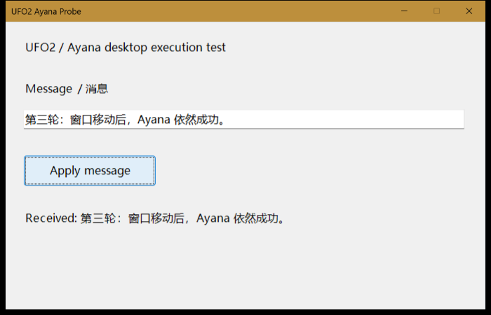

# UFO² 本机运行验证

日期：2026-10-04。结论：**完成适配后，连续 3 轮基础桌面任务通过**。安装后直接运行的前几次失败，因此不能把结果描述成“原仓库开箱即用”或“复杂任务已经稳定”。

## 测试对象与过程

- 上游：[Microsoft UFO](https://github.com/microsoft/UFO/tree/a795552d976c4c019d7c2f778a0effb5cef7de6b)，固定提交 `a795552d976c4c019d7c2f778a0effb5cef7de6b`。使用其中 UFO² 的 Windows 单机正常任务流程。
- 独立 Python 3.11.9 环境：`.runtime/experiments/ufo2/venv`。未替换 Ayana 产品依赖或运行时。
- 模型：Ayana 已配置的 `deepseek-flash`；使用真实模型请求。通过本地 HTTP 中继读取已有加密凭据，中继只在内存持有密钥，UFO 配置中的密钥为占位值。
- 目标：自建 WinForms 窗口 `UFO2 Ayana Probe`，包含输入框、按钮和结果标签。界面动作来自模型，不在测试脚本中写死输入或点击步骤。
- 实际路径：UFO `Session.run()` → HostAgent 选择窗口 → AppAgent 观察控件与截图 → 上游 MCP 工具和 ActionExecutor 执行 → 再次观察结果 → HostAgent 完成任务。
- 验证器独立读取测试窗口状态：输入内容精确相等、结果为 `Received: ` 加原文、按钮计数比运行前恰好增加 1。模型声称成功本身不能通过测试。

## 最终三轮结果

| 记录 | 条件及输入 | 实际动作 | 会话步数 | 总耗时 | 结果 |
| --- | --- | --- | --- | --- | --- |
| trial-5 | 替换已有错误文本为 `你好，Ayana！UFO 测试成功。` | `set_edit_text` → `click_input` | 5 | 21.718 秒 | 通过 |
| trial-6 | 替换为 `中文 + English 123，空格 保留！` | 同上 | 5 | 22.297 秒 | 通过 |
| trial-7 | 移动窗口后替换为 `第三轮：窗口移动后，Ayana 依然成功。` | 同上 | 5 | 23.031 秒 | 通过 |

按钮累计计数依次为 2、3、4；三轮各增加 1。每轮 Host/App 共进行了 5 次成功的模型请求，另外两次启动时的结构化输出能力探测返回 HTTP 400，随后 UFO 使用普通 JSON 文本继续任务。



## 跑通所需的调整

1. **依赖兼容。** 上游固定的 `pandas==1.4.3` 不适配本次 Python 3.11 安装，独立环境改为 `1.5.3`。本次关闭 RAG 与语义/图像控件过滤，未安装 `sentence-transformers` 和 `langchain_huggingface`。`pip check` 通过。可选 Galaxy 服务自动发现仍提示缺少 `networkx`，不影响本次 Host/App UI 流程。
2. **模型连接。** 原 SDK 连接在本机返回 502，中继没有收到请求。显式关闭 HTTP 客户端环境代理，并设置 localhost 代理绕过后恢复。配置仅连接本地中继，中继转发至原模型端点；设定 `thinking=disabled`、最多 4096 输出 tokens。
3. **截图与 DPI。** 本机为 175% 显示缩放。按屏幕矩形截取的早期画面包含了桌面背景；直接调用上游 PrintWindow 的早期画面还出现全黑或尺寸不匹配。最终使用目标 HWND 的 PrintWindow，在捕获时处理线程 DPI，并按窗口物理尺寸缩放。最终三轮截图只来自测试窗口。
4. **WinForms 控件发现。** 根窗口的 UIA descendants 只返回标题栏按钮，但对子控件 HWND 单独构造 UIA wrapper 可正确获得输入框与按钮。测试适配器在缺少 Edit 控件时，通过 Win32 枚举子 HWND，再转换为真实 UIA 控件；后续输入和点击仍由 UFO 的执行器完成。
5. **测试范围。** HostAgent 窗口列表只暴露测试窗口，截图和动作校验 HWND/PID；未启用命令执行工具。正常结束后关闭自建窗口，保留环境与记录。

这些适配在独立测试脚本中完成；没有修改上游任务规划和输入/点击实现，也没有接入 Ayana 正式桌面产品。

## 失败记录与限制

- trial-1：模型连接失败，未执行界面动作。
- trial-2 / trial-3：控件发现或截图异常，未完成目标。
- trial-4：使用 Win32 后端时模型得到空控件列表，转而尝试键盘操作。实际文本丢失空格并留下原有字符，验证器判定失败。这个记录说明必须验证真实结果，不能只接受模型的完成说明。
- 最终三轮解决了上述基础任务问题，但样本只有一个测试窗口，未覆盖浏览器、Office、Electron、自绘控件、弹窗、权限差异或长任务。
- 两个界面动作需要约 22 秒，说明完整 Host/App 协调链有明显开销。后续应在真实目标软件上评测后，再决定复用完整框架或只接入其执行组件。

## 本地复现与证据

实验目录：`D:\ayana-agent\.runtime\experiments\ufo2`。

- `source.json`：上游固定版本与下载信息。
- `requirements-probe.txt` / `installed-requirements.txt`：调整后的需求与实际安装版本。
- `test_window.ps1`：真实测试窗口与独立状态输出。
- `run_probe.py`：实际运行的适配、窗口范围约束和验证器。
- `trial-1.log` 至 `trial-7.log`：运行记录。
- `trial-5/report.json`、`trial-6/report.json`、`trial-7/report.json`：最终通过记录及模型用量。
- `upstream/logs/ayana-trial-*`：UFO 自身截图、响应与动作记录。

从仓库根目录，在关闭旧测试窗口后启动 fixture，再运行探针：

```powershell
$fixturePath = (Resolve-Path .runtime/experiments/ufo2/test_window.ps1).Path
$fixtureState = Join-Path (Resolve-Path .runtime/experiments/ufo2).Path 'window-state.json'
Start-Process powershell.exe -ArgumentList @('-NoProfile', '-STA', '-ExecutionPolicy', 'Bypass', '-File', $fixturePath, '-StatePath', $fixtureState) -WindowStyle Hidden
$env:PYTHONIOENCODING = 'utf-8'
& .runtime/experiments/ufo2/venv/Scripts/python.exe .runtime/experiments/ufo2/run_probe.py --trial trial-new --message '复现：中文 + English 123'
```

运行会使用已配置的模型凭据发出真实 API 请求。初次执行前需等测试窗口出现；使用新的 trial 名称保存记录。实验目录被 `.gitignore` 排除，当前机器上保留，未作为产品代码提交。
